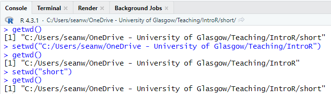
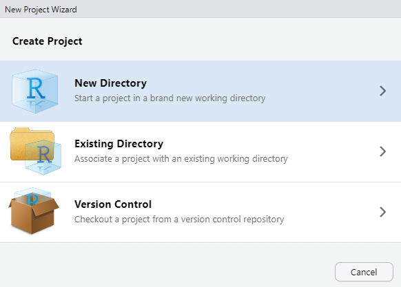
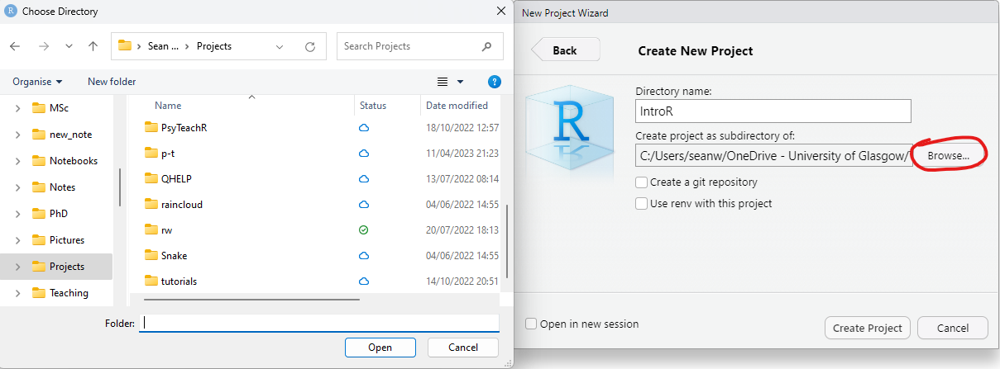

--- 
title: "Introduction to R"
author: Gaby Mahrholz, Greta Todorova, Wilhelmiina Toivo, and Jaimie Torrance, updated by Johanna Werner in 2022 and Sean Westwood in 2023
date: "`r Sys.Date()`"
bibliography: [book.bib, packages.bib]
biblio-style: "apalike"
description: This is the course handbook for the Glasgow University Open Studies course Introduction to R, academic session 2023/2024.
documentclass: book
link-citations: yes
site: bookdown::bookdown_site

---
```{r include=FALSE, cache=FALSE}
library(webexercises)
```

# About this course {-}

```{r setup, include = F}
# to render entire book run: bookdown::render_book(input = input_files) in the console with this object in the environment
input_files <- list.files()[endsWith(list.files(), ".Rmd")] 

knitr::write_bib(c(
  .packages(), 'bookdown', 'knitr', 'rmarkdown', 'tidyverse'
), 'packages.bib')
```

```{r setup2, include=FALSE}
library(tidyverse)
library(knitr)
library(webexercises)

add_to_bookdown()

# knitr::opts_chunk$set(echo = TRUE)
# if (!requireNamespace("webexercise")) {
#   stop("You must have the 'webex' package installed to knit HTML from this template.\n   devtools::install_github(\"psyteachr/webexercise\")")
# } else {
#   library("webexercise")
# }

```


This course is a short introduction on using R for dealing with data. 

## Intended Learning Outcomes {-}

The Intended Learning Outcomes (ILOs) for the entire course are:

* Demonstrate how R and RStudio work by transforming and cleaning different types of data into an appropriate format for analysis and creating graphical representations to visualise different types of data;
* Calculate summary statistics using R; and
* Interpret common error messages and use in-built help facilities to debug their code. 

Each chapter contained within will come with its own specific ILOs which will be clearly specified at the top of each page. 

These ILOs will be the points that will be covered in the assessments.

## What will I need to complete this course? {-}

To successfully complete this course, you will need access to a computer that either already has, or you can download R and RStudio software on. This computer will need to use a Windows, Mac or Linux based operating system. You *can* run RStudio on a Chromebook sometimes, but the process is more complex (see <a href="https://www.reddit.com/r/chromeos/comments/8r5lwb/r_studio_for_chromebook/">here</a>).

If you cannot use RStudio on your computer you might want to consider using <a href="https://rstudio.cloud/">RStudio Cloud</a>.

All University of Glasgow Library computers should have this software installed. If you have enrolled in the University, you should have access to these.

Before the first lesson you will be given the task of either installing R and RStudio on your own personal computer, or finding another suitable method of accessing the software. Full instructions will be given in [Chapter 1](\@ref(#accessing)) of this coursebook.

```{block, type = "info"}
**If you are having issues with access, talk to your tutors via the via the Microsoft Teams channel as soon as possible so that we can help you!** R, like any skill, will get better with practice and we want to ensure you can practice and complete the assessments as easily as possible.
```


## Why are these materials open? {-}

These materials have been adapted from various sources. Some of these materials have been Open Educational Materials with CC-BY-SA licenses. This means that any materials that use them must also be made open (SA means "share alike"). 

We also believe in the value of open educational materials. Your course fees contribute to the development of this course, but also to providing you with in-person classes and supporting staff.

## Acknowledgement {-}

The materials were initially developed for the University of Glasgow Short Courses for the academic term 2019/20 by [Gaby Mahrholz](https://www.psy.gla.ac.uk/otherstaff/?id=GM005), [Kate Haining](https://www.psy.gla.ac.uk/otherstaff/?id=KH001), [Rebecca Lai](https://www.psy.gla.ac.uk/otherstaff/?id=RL003), [Greta Todorova](https://www.psy.gla.ac.uk/otherstaff/?id=GKT01), and [Wilhelmiina Toivo](https://www.psy.gla.ac.uk/otherstaff/?id=TIWT1), and modified for the academic term 2023/24 by [Sean Westwood](https://www.gla.ac.uk/schools/psychologyneuroscience/staff/seanwestwood/)

<!--chapter:end:index.Rmd-->

```{r include=FALSE, cache=FALSE}
library(webexercises)
```
# Assignment before starting the course {-#before}

This assignment is an important one as it will enable you to complete your future assignments. It looks long, but it is mostly screenshots to guide you through the process of installing the required software, or a short guide on how to use RStudio Cloud.

## Access to RStudio {#accessing}

Please ensure by the next class that you have access to the software so that you can practice using the formative assignments and complete the summative assignments when they are issued.

The first summative assignment will be issued after class next week and you will be given one week to complete and submit it. 

### Installing R and RStudio on Your Own Machine {#install}

Unfortunately this is not as simple as installing software normally is on your computer. There are two separate things that you will need to install.

#### First: Install R

Follow <a href="https://www.stats.bris.ac.uk/R/">this link</a> and click on the part that says Download R R-4.2.3-win for Windows (or Mac). You will get the following pop-up dialogue (please note that as you are installing a newer version of R your download will be called R-4.2.3-win.exe instead of R-3.6.2 in the picture):

<center></center>

Click "Save File". The file will then be downloaded to your computer, most likely the "Downloads" folder unless you have changed your settings. Double click to run the file.

You will be asked if you want to allow this to make changes to your computer, click yes. Select your language preference, review the license agreement and click next. The following screen will be presented:

<center></center>

Click next without changing the folder. The next screen let's you customise the installation, but we shouldn't need to make any changes at this point so click next without unselecting any components:

<center></center>

Also leave the star-up options as standard and click next:

<center></center>

Leave the start menu folder as standard:

<center></center>

Don't make any changes to the additional tasks part, just click next:

<center></center>

The Install Wizard will then install R:

<center></center>

You will be told when installation is complete:

<center></center>

#### Second: Install RStudio

Follow <a href="https://rstudio.com/products/rstudio/download/">this link</a> to the RStudio website. Scroll down and press the button "Download" under RStudio Desktop- not the Server Option. On the next page press the button under stage 2, "Download RStudio for Windows". Your download will start and you will see the following prompt (note your as your download is a newer version it will again be named slightly differently RStudio-2023.03.0+386) :

<center></center>

Click "Save File" when the button becomes active.

Look in your download folder and double click the downloaded file. Click to allow the program to make changes to your computer. You will see this part next:

<center></center>

Click next on this next window. Do not change the installation location. Click next:

<center></center>

You will be taken to this screen. Again, don't change the start menu folder location here. 

<center></center>

Click next and the installation will begin:

<center></center>

You will then be notified when the installation is complete with this screen:

<center></center>

#### Opening RStudio

Remember that we have installed **two** programs on our computer. R, which is the base program, and RStudio, which is an extension of R.

The software that we want to open and use is RStudio, not R. We want the shiny interface and added features.

### Accessing RStudio on University Computers

If you have a student card you will be able to access computing facilities provided for students, including those in the various libraries across campus. All university computers should have R and RStudio installed, as well as the required packages for this course. 

You will not be required to install anything on university computers, please don't attempt to do so because we don't want the IT guys to yell at us.

To login to the university computers you will require your GUID and password.

### Using RStudio Cloud

We recognise that not all students will have access to their own computers, and that some of those students will not be able to travel to campus to use the provided facilities. For this reason we recommend to those in that postition to think about using RStudio Cloud, available [here](https://rstudio.cloud/). 

The RStudio Cloud allows you an electronic workspace, hosted by the RStudio team themselves.

Navigate to the page and click the "Sign Up" button at the top right-hand side of the page. 

Once you are logged in you will see your (for now) empty workspace:

<center></center>

Click on "new project" and you will be taken to this page:

<center></center>

As you can see it is almost identical to the way the program would appear on your computer if you had installed it there.

To name your project you can click the name at the top of the page and type in a new one:

<center></center>

You will also need to upload any data files to the server before you can work with them. This is done with the 
addition to the panel Files/Plots/Packages/Help/Viewer on the right- the "Files" pane now had a button to upload:

<center></center>

Pressing this will open a pop-up box. Click on the "browse" button, navigate through your directories and identify the file you wish to upload and confirm. Then press ok. The file should then be uploaded and displayed in the files pane.

<center></center>

```{block, type = "info"}
If at any point you are struggling to access the required materials or software it is important that you contact the tutors **at the earliest opportunity** to discuss the issues you are having. 

We want you to do well and have a good experience learning with us, let us know if you are experiencing difficulty so that we may help you resolve it!
```


## Maximising Reproducibility and Visibility

In order to set up R the way that we require, there are a few more steps. 

First, open RStudio and click on the Tools menu at the top of the page and click on the part that says "Global Options":

<center></center>

Next, a dialogue box will open. Ensure that these tick boxes and options are selected on yours and click apply:

<center></center>

Finally, go to RMarkdown and ensure that this option is unchecked:

<center></center>

This meaning of the first part will be discussed in future lessons, and the second will mean that graphs that you make will be in the "Plots" tab to the right of the console. This means that code will not be obscured whenever you make a graph.

<!--chapter:end:00-before.Rmd-->

```{r include=FALSE, cache=FALSE}
library(webexercises)
```
# Introduction

## Intended Learning Outcomes {-}

By the end of this chapter you should be:

1. Familiar enough with a computer to open, save and access previously saved files.
2. Able to describe R and Studio, the coding environment and the associated file types.
3. Able to install, load and describe the nature of R packages and describe the nature and use of functions in general.

## Computer Literacy Basics

In order to successfully navigate this course there are a number of things that you need to know about computers more generally. This section includes everything that you are *required* to know or learn. 

We are aware that many people will have been using computers for many years, and in some cases many people will have grown up with them in their household. We have noticed, however, that a number of our incoming students are not familiar with many of the basic concepts that are required to be a successful coder. There is an assumption that "digital native" automatically equates to "computer literate" but in many cases we have found this assumption to be incorrect.

More people than ever before are using some sort of personal computing device, but the type of use differs greatly from what we are going to be doing over the next 10 weeks. Many mobile phones, tablets and (increasingly) PC operating systems hide many of their operations from users. This can create a feeling of competency with computers that can quickly dissolve when asked to engage with anything slightly more complex.

If you already know most of this then we apologise, but there may be people with us who don't. This is a beginner class, so we thought it prudent to start us all off on the same footing.

## R and R Studio

Are they different? Yes! Is this important? Yes!

### R 
 

R is a programming language and completely free software, and it is widely used for data analysis. It is a stand-alone program and can be run on it's own without R Studio, but it's not particularly user friendly.

<center>  </center> 

### RStudio IDE 
 

RStudio IDE (short for **I**ntegrated **D**evelopment **E**nvironment) is essentially a shiny facade, which sits atop R and gives it many useful features and makes it much *easier to use*. 

When you first open it you get 3 main panels, which can be seen in the picture below.

<center>  </center>

#### Console

This is essentially the same thing as R commander. You can run code in here, and it can be a useful playground to try out new things and do things that you don't necessarily want saved into a script because **it's not permanent- anything typed here will be lost when you close R**!

Examples of things you might want to run in the console include, but are not limited to, running new functions and seeing what they do, or installing packages (never EVER done in a script). 

This is what the console looks like before you have run any code:

<center>  </center>

#### Environment/History/Connections

This panel is tabbed, with 2 tabs that you need to pay particular attention to right now:

- **Environment**: this contains all of the virtual "objects" that you have created. These include, but are not limited to, variables containing data that you have read in, lists, individual values, custom-written functions.

    Objects can and should be created in your scripts. When you close R you might lose some of the objects, but as long as you have the script containing the instructions to re-create these objects you can re-run it and make them again.

- **History**: this is a list of all of the commands that you have run in the past "session", which can be useful to go back to some times if you did run some code in the console that you want to look at again. To scroll through you can put the cursor in the console window and use up and down keys.

At this point you don't really need to worry about the one called connections (it lets you connect to things like online data sources).

This is what that panel looks like for me right now... it's empty!

<center>  </center>

#### Files/Plots/Packages/Help/Viewer

This panel set is going to be extremely useful to you throughout the duration of your career as an R user. Viewer is not immediately required, so we'll just cover Files, Plots, Packages and Help.

- **Files**: Shows a file browser that lets you look around in your file structure. helpful hint: click on the more button and "Go to working directory" to see the same files that R can see. **You *can* load files in through this tab, but you should always strive to do it in the script!**

- **Plots**: A tab that displays plots that you have made. You can navigate backwards and forwards between multiple plots- allowing you to test out new things and see the changes in comparison to each other.

- **Packages**: This allows you to look at the R packages that are installed on the machine that you are using, and the check box next to it indicates if it is loaded in from the library. **You *can* click the box to load a package, but you should always strive to do it in the script!**

- **Help**: this window displays the built in help information, much the same as Microsoft Word or Powerpoint has. You can search using the search box, but you can also type into the console. For example, if I wanted to find the help file for the `library()` function I would type `?library`. the result is displayed in the help tab to the right.

<center>  </center>

  Alternatively, you can type the name of the function you want help with into the search box in the help tab:

<center>  </center>

Sometimes these files are not exactly written in a manner that could be considered accessible to novice users. You get the hang of reading them over time. In this case you might want to try Googling it... we **all** do it, no matter our level of experience! 

Even Googling can be difficult, but you will eventually get a better idea of the types of search terms most likely to direct you to the information that you are after. 

## R, R Studio and Associated File Types

When you open a program, such as Microsoft Word, you haven't actually created a Word document you've just started the program. Opening RStudio is much the same. Even though it can function without opening a file, there is much utility to be added by opening a file. 

When you open a file, the console will shrink and the space taken away in the window will be taken up by the new file.

Opening a new file allows you to write code that can be saved, amended, shared etc. Code sharing is an important aspect of reproducibility!

R can handle a lot of different files types, we will only focus on the two types. These are .r and .Rmd files. Both are saved as plain text files. Many of the files R uses are plain text files at their core. What changes is how R interprets the files, and the types of outputs that you can get from them.

### Setting the working directory

If using .R scripts instead of .Rmd scripts, it is good practice to set your working directory to the folder you are working with. Firstly, there are two main ways you can view your current working directory: 

1. Using the function `getwd()` in your console will print the path to your current working directory.

2. You can also see the path to the working directory at the top of the console (circled in red below)

<center></center>

If you ever need to view the files in your current working directory, you can click on the small arrow circled in green!


There are then several ways you can change your working directory:

1. In the menu, go to **Session > Set Working Directory > Choose Directory** (Ctrl + Shift + H also works as key short cut in a Windows environment). Then select the folder containing the data file and click 'open'. You might not see any files in the folder you are selecting - that is fine.

2. In the `Files pane`, you could navigate to today's folder, and once there click on **More > Set As Working Directory**. 

3. In the console, you can use the `setwd()` function and provide the path to the directory you want. This can either be the absolute path e.g. `setwd("C:/Users/seanw/Documents")`, or a relative path where you specify the path from your current working directory. The image below shows first using the absolute path, then the relative path.

<center></center>


### File Structure/Directories

Your files should be stored in something called **"directories"**. This is the technical name for a folder. It is a storage space on your computer. Here you can see all of the files contained within the folder for this course document in the **"File Explorer"**, the program used to view files and folders in Windows:

<center>  </center> <br>

Each folder and the files within will have a specific **"file path"**, an address within your file storage system that allows you and the computer to pinpoint the location of the information that you and it need to perform tasks involving that file. In windows you can get the file path of a folder by clicking on the bar at the top of the folder when you are looking in it in the file explorer:

<center>  </center> <br>

This will be necessary later when you start to use RStudio in conjunction with external files, such as data files.

### File Extensions

Files come in different types, and each different type comes with a different **file extension**, meaning that it is associated with a different type of program. A **file extension** is that part after a full-stop in the file name. Some common ones are:

- .xlsx: a spreadsheet file associated with Microsoft Excel
- .docx: a formatted text document associated with Microsoft Word
- .pdf: a **P**ortable **D**ocument **F**ile, commonly text and images, associated with Adobe Acrobat
- .txt: a plain text file, can be opened in multiple programs such as Notepad or other word processing software.
- .zip: a *compressed folder* which can contain many files. These files must be *uncompressed/extracted* before you use them successfully.

### .zip Files

In this course we will sometimes ask you to download a folder with multiple files and this will be stored in the 'Files' section on teams as a zip file. A zip file is a folder that contains files that have been compressed to make the file size smaller and enables you to download multiple files at once, however, before you use the files from a zip folder you first need to extract them.

1. Click on the link to download the compressed folder.
2. Navigate to the zip file (probably in your downloads folder) and open it. You will see all the files it contains but don't use these - click "Extract all" on the top ribbon.
3. You will be asked to select a location to save the unzipped files. Normally the default location it suggests will be the same folder and so you can just click "Extract". If you want to unzip these files to a different place click browse and select the folder you want to keep it in. I like to keep all the files for one project in the same folder.
4. You can now delete the zip file and use the unzipped files. This is a really important step - if you use the compressed files your code may not work properly. This usually causes error messages relating to temporary files.

<center> <figure><figcaption>Adapted from Level 1 Data Skills, [@l1book].</figcaption></figure> </center> <br>

### RStudio Specific Files

RStudio uses many different types of files, but each is a variation on a **"plain text" file**. This means that all files we will be using in class will be able to be opened in Notepad or other similar text programs. The three main ones we will be working with will be:

- .r: an R script
- .Rmd: an RMarkdown document
- .csv: **C**omma **S**eparated **V**alues file, a common and universal type of file containing data sets.

```{block, type = "danger"}
If the file extension on a file is incorrect it may not be recognised as a file to be opened with a specific program and might not work.

This is particularly an issue when you are downloading your files for class. As they are technically "plain text" files, some internet browsers will download them with the extension ".txt", or even add it on as a second one which doesn't work! Changing the extension to ".Rmd" or removing the extra added one will solve this issue.
```

### .R Files

This is what we refer to as a script. It is designed to be read by R, not so much by humans. To create a new script go to File > New File > R Script. This is what will be brought up:

<center>  </center> <br>

All of the text in an R script will default to being read as **executable code (that is, text which is directed at the machine)**. We can, however, tell R **not** to read it as executable code, but instead for the machine to ignore certain parts of it, by using something called **comments**- you will read more about these below.

### .Rmd files

These are the types of files that you will mostly be using during this class. You will also be given some pre-formatted ones to complete your assessments on. 

When you go to File > New file > R Markdown... you will be prompted to supply some information. You can do this, but don't have to as you can change many of these parameters later:

<center>  </center> <br>

When a new RMarkdown file is opened the file isn't empty. What you actually get is an example with a YAML header (at the top bordered with the dashes), some code chunks (in the shaded sections, more on these in a minute), text and some headers (the blue text with the hashes (#) **outside** of chunks).

I like to think of the way this file type is interpreted as being *like a script, but flipped*- the default interpretation of text aimed at humans. If we want **executable code** we need to prompt R to read the text in this way. This is done using "code chunks", or sometimes just called "chunks".

One key difference between .R files and .Rmd files is the way they look for files (e.g. if you are loading in data). With .R files, they look for things by starting wherever the working directory is currently located, whereas .Rmd files look for things starting where that .Rmd file is currently located.

<center>  </center> <br>

#### Code Chunks

Code chunks are bordered by "backticks", which look an awful lot like apostrophes but they are different! These are important as they tell R where it needs to start and stop reading. 

Chunks also contain "curly brackets" at the start which contains various bits of information necessary to how the computer reads it. This includes what programming language you are writing in there (yes! R can understand other programming languages!), name of the chunk (used for a variety of reasons, such as our marking software and document indexing) and other attributes which are not necessary to learn about right now. 

<center>  </center> <br>

```{block, type = "danger"}
The chunk **must** have the backticks to show the beginning and end of the executable code, otherwise the code doesn't run. 

You must not add any code or text to the lines which contain backticks other than the code to alter the attributes of the chunk within the curly brackets (and only if you know how to do so). If you do this the code will not run and other chunks in the document might also be affected.

```

Hashtags used inside of code chunks don't result in headers, but rather are ignored as the comments discussed in the section about .r files.

## Comments

Comments can- and should- be used throughout both .r and .Rmd file types. These are anything written *after* a hash symbol (and, if using a .Rmd file, within a code chunk). This symbol instructs the computer to disregard this text, letting it know that this is not for it to interpret as executable code but rather it is something for the human user to read and interpret.

These are handy for letting others know what each piece of code was written to do, or to inform your future self of what you were doing.

Make use of comments in the code we write in class and let this function as your class-notes.

```{r comment_example}
# this is what a comment looks like. Anything AFTER a hash.
# R doesn't "speak" natural languages so it would not be able 
# to understand any of this and would give errors!

# comments are for humans. You can use them to put notes in scripts to
# remind yourself of what is happening, or to inform people with whom
# you have shared your code.
```

## Saving your file

As mentioned before, anything in the console vanishes when you close R. Any objects that you have used code to make (those things that live in the environment) should vanish too.

Your script is a set of instructions on how to make those objects. If you have saved your script or markdown, you can just re-run it and get back to where you left off when you last saved your progress. 

Saving your file for the first time is as easy as going to File > Save As and filling in the details in the dialogue box as appropriate:

<center>  
 </center> <br>

Saving changes to an already existing file is done by going to File > Save:

<center>  </center> <br> 

## Sessions

### What is a session in R?

A session in R is a segment of time/workspace/processor time that is dedicated to performing a specific processing or analysis task. It can be difficult to wrap your head around at first, but it helps to draw comparisons with software that we are already familiar with.

Let's go back to Microsoft Word. We can have an essay open in one window and class notes opened up in another window. Both are instances of Word, but they are dedicated to two different tasks which just so happen to be running concurrently.

You can have multiple sessions open in R, but we wouldn't recommend it, because it can become confusing. We can start a new session by going to Session > new session. We are much more interested in a task which is closely linked to this idea- restarting your current session.

<center>  </center> <br>

### Restarting Your Current Session

This can be done by going to Session > Restart R, see the image above.

Restarting your R session does some important things:

* it clears the environment of objects if R is set up in a maximally reproducible way- so make sure your script is saved so that you keep the instructions for making them again
* it "unloads" packages that you have called from the library using the `library()` function
* If you encounter an error with an unknown source sometimes restarting the session can clear the problem
* It allows you to test the reproducibility of the script that you are writing by clearing the environment and starting over with only the instructions you have provided, without the possibility of "contamination" of objects inadvertently created in other ways, such as playing in the console

## Packages

R is a programming language which is primarily used for data processing and analysis. As the software is open source a number of people have created extensions to the software to adapt it to their needs.

These software extensions are referred to as "packages".

### Installing Packages

There are a number of functions that we will be using in this course that are not part of the original programming language. The most common package we will be using will be one called "tidyverse".

We will use the example of tidyverse to show you how to install packages that you might need.

#### What is Tidyverse? {#install-tidyverse}

```{block, type = "danger"}
Do not install any packages on the university machines. All the packages you need are already installed. You would only need to install packages if you are using your own machine.

You must also never place `install.packages()` in any r script or RMarkdown document: installing it a second time can break the installation and by sharing this script you would be attempting to force others to install it on their machines.

This is at best rude and at worst it can break their installation.
```

Tidyverse is a "metapackage"- a package that is actually a collection of packages that have been bundled together. It was developed by Hadley Wickham. You can read more abut the package <a href="https://www.tidyverse.org/">here</a>.

#### `install.packages()`

When you install a package, you should do this in the console part of the interface, as shown here:

<center>  </center>

Types the following in and then hit "enter":

```{r install_packages, eval = F}
> install.packages("tidyverse")
```

Note that the name of the package is in quotation marks when used here. This is not always the case!

The console will then fill with a lot of text showing you what is being done. It is not necessary to understand all of this. 

Look out for this message being printed in the console

<center></center>

This indicates that the package has been installed successfully. There will be many of these messages for different packages. There may even be parts after this message if the computer determines that other "dependencies" (additional software that tidyverse requires to run) are required. 

Once R has stopped working (doing it's current task) the `>` will reappear in the console. This symbol reappearing means that R is ready for further code.

To install other packages you would reuse the **function** `install.packages()`, replacing the name "tidyverse" with the name of the package you want to install. 

We will cover functions shortly.

### Loading Packages {#load-tidyverse}

Now that we have installed tidyverse it is on our machine but it is not ready to use yet!

It is easier to understand if you think about it like this: if you install Instagram on your phone you only do it once and you have to open the app each time you want to use it.

Similarly, once tidyverse is installed it is on your computer until you remove it. If you want to use it you need to "open it". This is done by using another **function**, `library()`.

```{r library, eval = F}
library(tidyverse)
```

This must be done before you use tidyverse. We normally do this in the first chunk in the document, essentially gathering our tools before we start working.

If you want to load other packages you would reuse the **function** `library()`, replacing "tidyverse" with the name of the package you want to load.

## Functions

"Function" is a word that you will hear a lot in this class. But what are they? What do they look like? what are they made up of?

### What is a function?

If I were to tell you to jump, you would understand the action I was asking you to perform wouldn't you? But before you carry it out you might ask me a question in return: how high?

This is what a function is for R... it's a command that tells R to do something. It just does it in a way that R understands.

### The Anatomy of a Function: names and arguments

Functions are made up of elements. See the code chunk below:

```{r eval = F}
function_name(argument1, argument2, etc...)
```

The part outside of the brackets is the **name of the function**. This tells R exactly what to do- the action to be performed. The parts inside the brackets are called **arguments**... these provide information to R on what to perform the actions on (and input) and can provide information on slight changes to the actions.

```{block, type = "info"}
Essentially the function name is the action to perform (jump) and the arguments give information on how to perform the action (how high).

Think about `install.packages("tidyverse")` and `library(tidyverse)`: what are the function names and what are the arguments? Which part changes when you want to install and load a different package?
```

Once your function has taken the input and run the command on it, it will produce an output. 

As we progress through this course, see if you can spot the functions, the arguments, the inputs and the outputs.


### Installing and Loading tidyverse

Use the information in the section \@ref(install-tidyverse) above to install the tidyverse package on your RStudio installation.

```{block, type = "info"}
If you are using RStudio Cloud you are provided with a completely self-contained computing environment. This means that you can `install.packages()` on your virtual RStudio too as required.
```

Load tidyverse from the using the `library()` function in section \@ref(load-tidyverse). *For now* you can do this in either a new .r file, .Rmd file or even in the console. 

If you successfully load it you will see this printed in the console:

<center></center>

<!--chapter:end:01-intro.Rmd-->

```{r include=FALSE, cache=FALSE}
library(webexercises)
```
# Introduction to Data

## Intended Learning Outcomes {-}

1. Understand basic data types
2. Create and store vectors 
3. Convert data types into one another
4. Create a data table from scratch
5. Import and store data


## Pre-Steps

Before we begin, we need to do some house-keeping.

### Downloading materials

First, we need to download the materials we are working with in this chapter. It's a .Rmd file called `L2_data`, and a zip folder that contains all of the data we will be using in this course in `.csv` format. `L2_data` has all the code chunks needed for today's lesson. You are more than welcome to add notes and comments to the Rmd, however there is no need to copy any code.


### Creating an R Project

Next, we are going to create a project folder where we will store all of our scripts, data, and everything else associated with the course. To do this, we first need to select 'New Project' from the file menu in RStudio:

<center>  </center>

Then we will select the 'New Directory' option: 

<center>  </center>

Followed by the 'New Project' option: 

<center>  </center>

Now we can choose a name for our new project folder (e.g. IntroR), and select 'Browse' to choose a location for the new folder. It is important to choose a location on your computer that is easy to access and well-suited for storing files (e.g. Documents, OneDrive, etc.). I would not typically recommend choosing the Desktop for this!

<center>  </center>

Finally it is just a case of clicking 'Create Project', and a new folder should appear containing a .RProj file. The R Project file will help us keep everything organised - it automatically sets the working directory and files pane to the project home folder, and you can very easily pick up where you left off by opening the project either from within R (e.g. File -> Recent Projects) or by clicking on the .RProj file in your project folder. 


### Moving the downloaded materials into our project folder

First move the 'L2_data.Rmd' file into the project folder we just created. 

The data folder we have downloaded is a zip folder. Right-mouseclick on the zip folder, then choose `Extract All...`.

Extract the contents to the project folder that you just created in the previous step. This should create a sub-folder called 'data' containing a series of .csv files. This is where we will access files from throughout the course.

Your project folder should now contain the .RProj file, a .Rmd file called 'L2_data', and a folder called 'data' containing a bunch of .csv files. If this seems to have worked, you are ready to open up the L2_data script and begin working on this chapter!


### Load tidyverse into the library

We will be using a few functions today that are part of the `tidyverse` package compilation. Let's load tidyverse in the library now, so we do not have to worry about it later on.

```{r L2}
library(tidyverse)
```


## Basic data types

There are plenty data types, however for our purposes we will be focusing on:

| data type | description                | example                  |
|:----------|:---------------------------|:--------------|
| character | text string                | `"hello World!"`, `"35.2"`, `'TRUE'` |
| double    | double precision floating point numbers | `.033`, `-2.5`            |
| integer   | positive & negative whole numbers       | `0L`, `1L`, `365L`        |
| logical   | Boolean operator with only two possible values  | `TRUE`, `FALSE`   |


### Character

You can store any text as a value in your local environment. You can either use single or double inverted commas.

```{r quote, eval=FALSE}
my_quote <- 'R is Fun to learn!'
cat(my_quote) # cat() prints the value stored in my_quote
```


If you want to use a direct quote, you need to include a backslash before each inverted comma.

```{r direct quote}
direct_quote <- "My friend said \"R is Fun to learn\", and we all agreed."
cat(direct_quote)
```

```{block, type="info"}

You can check the data type using the `typeof()` function. If you want to know which class they belong to, you can use the `typeof()` function.

```


### Numeric

`double` and `integer` are both class numeric. Double is a number with decimal places whereas integer is a number that's a full number. Any number will be stored as a `double` unless you specify `integer` by adding an L as a suffix.

Example:

```{r}
typeof(359.1)
typeof(5)
typeof(45L)
```


### Logical

A logical vector is a vector that only contains TRUE and FALSE values. You can use that type of data to compare (or relate) 2 pieces of information. We have several comparison (or relational) operators in R. A few of them are:

<center>  </center>

More information on logical comparison operators can be found on https://bookdown.org/ndphillips/YaRrr/logical-indexing.html (from which the above image was modified).

You could compare if two values are equal...

```{r}
100 == 100
```

... or if they are not equal.

```{r}
100 != 100
```

We can test if one value is smaller or equal than the other...

```{r}
5 <= 9-4
```

... or if one value is larger than another.

```{r}
101 > 111
```

Note that it works with character strings as well. (Not really important for this class though)

```{r}
# "a" == "a" would be TRUE as both side of the comparison contain the same information.
"a" == "a"

# "a" <= "b" would be TRUE as a comes before b in the alphabet (i.e. 1st letter vs 2nd letter)
"a" <= "b"

# "abc" > "a" would be TRUE as there are more values on the left than on the right
"abc" > "a"
```


<span style="font-size: 22px; font-weight: bold; color: hsl(24, 100%, 50%);">Question Time</span>

Run the following examples in your Console and select from the drop down menu what data type they belong to:


* typeof(1): `r mcq(c("character", answer = "double", "integer", "logical", "Error message"))`
* typeof(1L): `r mcq(c("character", "double", answer = "integer", "logical", "Error message"))`
* typeof(1.0): `r mcq(c("character", answer = "double", "integer", "logical", "Error message"))`
* typeof("1"): `r mcq(c(answer = "character", "double", "integer", "logical", "Error message"))`
* typeof(1L == 2L): `r mcq(c("character", "double", "integer", answer = "logical", "Error message"))`
* typeof(1L <= 2L): `r mcq(c("character", "double", "integer", answer = "logical", "Error message"))`
* typeof(1L <= 2L, "1"): `r mcq(c("character", "double", "integer", "logical", answer = "Error message"))`


`r hide("Explain this - why is 1 not an integer?")`
```{block, type = "solved"}

Any number will be stored as a `double` unless you specify `integer` by adding an L as a suffix.

```
`r unhide()` 


## Vectors 

Vectors are one of the very simple data structure in R. You could define them as "a single entity consisting of a collection of things". 


### Creating vectors

If you want to combine more than one element into one vector, you can do that by using the `c()` function. c stands for combine or as my colleague once said, it's hugging multiple elements together. All elements in the vector have to be of the same data type.


**Examples:**

This is a vector of datatype `double`.
```{r}
c(1, 2.5, 4.7)
typeof(c(1, 2.5, 4.7))
```

This is a vector of datatype `integer`. Adding the `L` makes it an integer, but see that in the printout the `L` is actually omitted.

```{r}
c(0L, 1L, 2L, 365L)
typeof(c(0L, 1L, 2L, 365L))
```

This is a vector of datatype `character`.
```{r}
c("hello", "student")
typeof(c("hello", "student"))
```
This is a vector of datatype `logic`.
```{r}
c(TRUE, FALSE)
typeof(c(TRUE, FALSE))
```

We have seen what vectors look like. If you want to store these vectors in your global environment, all you need is the `assignment operator <-` and a `meaingful name` for "the thing" you want to store. Here the first example reads like: "Take a vector of 3 elements (namely 1, 2.5, 4.7) and store it in your `Global Environment` under the name `vec_double`." You can then use the name you assigned to the vector within the `typeof()` function, rather than the vector itself.

```{r}
vec_double <- c(1, 2.5, 4.7)
typeof(vec_double)

vec_integer <- c(0L, 1L, 2L, 365L)
typeof(vec_integer)

vec_character <- c("hello", "student")
typeof(vec_character)

vec_logic <- c(TRUE, FALSE)
typeof(vec_logic)
```


```{block, type = "funfact"}
Funnily enough, a vector `i <- c(1,3,4,6)` would be stored as a `double`. However, when coded as `i <- 1:10` would be stored as an `integer`.

Don't believe it? Try it out in your Console!
```


<span style="font-size: 22px; font-weight: bold; color: hsl(24, 100%, 50%);">Question Time</span>

```{block, type="task"}

**Your turn**

* Create a vector of your 3 favourite movies and call it `favourite_movies`. What type of data are we expecting?

* Pick a couple of your family members or friends and create a vector `years_birth` that lists their year of birth. How many elements does the vector have, and what type of data are we expecting?

* Create a vector that holds all the letters of the alphabet and call it `alph`.

* Create a vector with 3 elements of your name, age, and the country you are from. Store this vector under the name `this_is_me`. What type of data are we expecting?
```


`r hide("Explain this!")`
```{r}
# Gaby's solution:
favourite_movies <- c("Red", "Cloud Atlas", "Hot Fuzz") # character
years_birth <- c(1953, 1975) # double
alph <- letters # muahahahaaaa! & character
this_is_me <- c("Gaby", 38, "Germany") # character
```


```{block, type = "solved"}
More detailed explanations:

R has Built-in Constants:

* `letters`: the 26 lower-case letters of the Roman alphabet; <br>
* `LETTERS`: the 26 UPPER-case letters of the Roman alphabet; <br>
* `month.abb`: the three-letter abbreviations for the English month names; <br>
* `month.name`: the English names for the months of the year; <br>
* `pi`: the ratio of the circumference of a circle to its diameter

Of course, the task could have been solved typing alph <- c("a", "b", "c", "d", "e", "f", "g", "h", "i", "j", "k", "l", "m", "n", "o", "p", "q", "r", "s", "t", "u", "v", "w", "x", "y", "z")

`this_is_me` would be stored as a `character` vector despite having text as well as numeric elements. Remember how we said earlier that all elements have to be of the same data type? After the next section, you will understand why they are stored as a character and not as a numeric vector.

```
`r unhide()` 


### Converting vectors into different data types of vectors aka funky things we can do

We can also reassign data types to our vectors we have just created. For example if we wanted to turn our `var_double` from `double` to `character`, we would code

```{r}
vec_double_as_char <- as.character(vec_double)
typeof(vec_double_as_char)

```

In your Global Environment, you can now see that the vector `vec_double` has 3 numeric elements (abbreviated `num`), whereas `vec_double_as_char` has 3 character elements (abbreviated `chr`). Also note that the numbers 1.2, 2.5, and 4.7 have now quotation marks around them.

Likewise, if we wanted to turn our integer vector `vec_integer` into data type `double`, we would use

```{r}
vec_integer_as_double <- as.double(vec_integer)
typeof(vec_integer_as_double)
```

In your Global Environment, see how `vec_integer` has `int` assigned to it, whereas `vec_integer_as_double` is now listed as `num`. The `typeof` function revealed that the 4 elements of `vec_integer_as_double` are now stored as data type `double`.


However, trying to turn a character vector into an `integer` or a `double` would fail. 

```{r}
vec_char_as_int <- as.integer(vec_character) # same outcome if we tried as.double
typeof(vec_char_as_int)
```


R would still compute "something" but it would be accompanied by the above warning message. As you can see in your Global Environment, `vec_char_as_int` does indeed exist as a numeric vector with 2 elements, but `NA` tells us they are classified as missing values.


A logical vector can be converted into all other basic data types.

```{r}
vec_logic_as_int <- as.integer(vec_logic)
vec_logic_as_int
```

`TRUE` and `FALSE` will be coded as `1` and `0` respectively when converting a logical into a numeric vector (integer or double). When converting a logical into a characters, it will just read as `"TRUE"` and `"FALSE"`.

```{r}
vec_logic_as_char <- as.character(vec_logic)
vec_logic_as_char
```

<span style="font-size: 22px; font-weight: bold; color: hsl(24, 100%, 50%);">Question Time</span> 


Remember the vector `this_is_me`? Can you explain now why it was stored as `character`?


`r hide("Nope, I don't get it!")`
```{block, type = "info"}

`this_is_me` would be stored as a `character` vector because this is the best way to retain all information. If this were to be stored as a `numeric` vector, the name and home country could only be coded as missing values `NA`. So rather than trying to turn everything into a number (which is not possible/ does not retain meaningful information), R turns the number into character (which is possible). 

```
`r unhide()`

<br>

With this in mind, what data type would the vector be stored as if you combined the following elements? 

1. logical and double - i.e. c(TRUE, 45)
2. character and logical - i.e. c("Sarah", "Marc", FALSE)
3. integer and logical - i.e. c(1:3, TRUE)
4. logical, double, and integer - i.e. c(FALSE, 99.5, 3L)


`r hide("Solution")`
```{block, type = "solved"}
1. double
2. character
3. integer
4. double
```
`r unhide()`


### Adding elements to existing vectors

Let's start with a vector called `friends` that has three names in it.
```{r}
friends <- c("Gaby", "Wil", "Greta")
friends
```

We can now add more `friends` to our little group of `friends` by adding them either at the end, or the beginning of the vector. `friends` will now have four, and five values respectively, since we are "overwriting" our existing vector with the new one of the same name.

```{r}
friends <- c(friends, "Kate")
friends

friends <- c("Rebecca", friends)
friends
```


Vectors also support missing data. If we wanted to add "another friend" whose name we do not know yet, we can just simply add `NA` to `friends`.

```{r}
friends <- c(friends, NA)
friends

```

The vector `friends` would still be a character vector. Missing values do not alter the original data type. However, if you look in the Global Environment, you can see that the number of elements stored in `friends` increased from 5 to 6. To determine the number of elements in a vector in R (rather than eye sight), you can also use a function called `length()`. 

```{r}
typeof(friends)
length(friends)
```

Well, now we decided that 5 friends in our little group of friends is sufficient, and we did not want anyone else to join, we could remove the "placeholder friend NA" by coding

```{r}
friends <- friends[1:5]
friends
```

You can see that the length of the vector `friends` is now back to 5 again.

```{block, type = "funfact"}
`1:5` uses the colon operator`:` which is read as in "access the vector elements 1, 5, and everything in between". An alternative way of writing out the above without using a colon operator would be `friends[c(1,2,3,4,5)]`. Notice that you need the `c()` function again.
```


Just as easily, we can create vectors for numeric sequences. The function `seq()` is a neat way of doing this, or you can use the colon operator`:` again. Just with the elements in the vector above, the same logic applies here. For example `1:10` means, you want to list number 1, number 10, and all numbers in between.

```{r}
sequence1 <- 1:10
sequence1

sequence2 <- seq(10)
sequence2

# compare whether sequence1 and sequence2 are of the same data type
typeof(sequence1) == typeof(sequence2)

# compare whether elements of sequence1 are the same as the elements in sequence2 
sequence1 == sequence2
```

<span style="font-size: 22px; font-weight: bold; color: hsl(24, 100%, 50%);">Question Time</span>

* What data type is `sequence1`? `r mcq(c("character", "double", answer = "integer", "logical"))`
* What data type is `sequence2`? `r mcq(c("character", "double", answer = "integer", "logical"))`
* If we were to store the output of `sequence1 == sequence2` in a vector, what data type would the vector be? `r mcq(c("character", "double", "integer", answer = "logical"))`


## Tibble - the new way of creating a dataframe

### What the heck is a tibble? Do you mean table?

First of all, tibble is not a spelling error; it's the way r refers to its newest form of data table or dataframe. Strictly speaking, a tibble is a list of vectors.


You can create a dataframe either by using the `tibble()` function or a function called `data.frame()`. `tibble()` is part of the package `tidyverse` whereas `data.frame` can be found in base R and does not need an additional package read into the library. Tibbles are slightly different to dataframes in that

* they have better print properties (Dataframes print ALL data when you call the data whereas tibbles only print the first 10 rows of data)
* character vectors are not coerced into factors (which you will be thankful for later on in your programming life)
* column names are not modified (for example if you wanted to make a column called `Female Voices` you could just do that. `tibble` keeps it as `Female Voices` with a space between the two words, whereas the `data.table` function would change it to `Female.Voices`)

If you want to read more about the differences between dataframes and tibbles (and appreciate the advantages of tibbles), have a look on https://cran.r-project.org/web/packages/tibble/vignettes/tibble.html.


### How to make a tibble from scratch

Now that you have learnt how to create vectors, we can try and combine them into a tibble. The easiest way is to use the `tibble()` function. Let's say we want to create a tibble that is called `tibble_year` with 4 columns:

* The first column `month` lists all months of the year
* The second column `abb_month` gives us the three-letter abbreviation of each year.
* The third column `month_num` tells which number of the year is which month (e.g. January would be the first month of the year; December would be number 12).
* The fourth column `season` would tell us in which season the month is (Northern hemisphere). 

Remember the Built-in Constants we were talking about earlier?

```{r}
tibble_year <- tibble(month = month.name,
                      abb_month = month.abb,
                      month_num = 1:12,
                      season = c(rep("Winter", 2), rep("Spring", 3), rep("Summer", 3), rep("Autumn", 3), "Winter"))

tibble_year
```

The generic structure of each of these columns we are creating is `column header name` `=` `values to fill in the rows`.

```{block, type = "info"}
Here, we used the built-in replication function `rep()` to build the column `season` which is a more time-efficient approach than typing out 4 seasons 3 times. Of course, we could have written season = c("Winter", "Winter", "Spring", "Spring", "Spring", "Summer", "Summer", "Summer", "Autumn", "Autumn", "Autumn", "Winter") instead.
```


We can now use the function `glimpse()` to see which data types our columns are. This is a very handy function to keep in mind for later!

```{r}
glimpse(tibble_year)
```


`glimpse()` tells us that our tibble has one column that is an integer, and three columns that are character strings. If we wanted to influence which datatype the columns (something that is not automatically assigned), we can do that by using the functions `as.double()`, `as.character()`, `as.integer()`, etc. we have seen earlier when we were talking about vectors. For example, if we wanted to modify the `integer` column as a `double`, we would type


```{r}
tibble_year2 <- tibble(month = month.name,
                       abb_month = month.abb,
                       month_num = as.double(1:12),
                       season = c(rep("Winter", 2), rep("Spring", 3), rep("Summer", 3), rep("Autumn", 3), "Winter"))
```


```{block, type = "warning"}
If you click on the name of the dataset in your `Global Environment` to view your dataframe, you would see no actual difference between `tibble_year` and `tibble_year2`. However, `glimpse()` would tell you.

If I were a mean person, and had recoded month_num = as.character(1:12) instead, you would not see it when you visually inspect the data. What would the consequences be?
```


<span style="font-size: 22px; font-weight: bold; color: hsl(24, 100%, 50%);">Question Time</span>

```{block, type="task"}

**Your turn**

Make a tibble called `mydata` with 5 columns and 6 rows:

* column 1 is called `PP_ID` and contains participant numbers 1 to 6. Make sure this data type is `integer`.
* column 2 is called `PP_Age` and and contains the age of the participant. Make sure this data type is `double`.
* column 3 is called `PP_Sex` and contains the sex of the participant. Even PP_IDs are male, odd PP_IDs are female participants.
* column 4 is called `PP_Country` and contains the country participants were born in. Surprise, surprise - they were all born in Scotland!!!
* column 5 is called `PP_Consent` and is an overview whether participants have given their consent to participate in an experiment (TRUE) or not (FALSE). Participants 1-5 have given their consent, participant 6 has not.
```


`r hide("Solution")`
```{r, eval = FALSE}
# Gaby's solution:
mydata <- tibble(PP_ID = 1:6,
                 PP_Age = c(22, 21, 24, 36, 33, 25),
                 PP_Sex = rep(c("Female", "Male"), 3),
                 PP_Country = "Scotland",
                 PP_Consent = c(rep(TRUE, 5), FALSE))
```

```{block, type="info"}
But there are plenty of other ways how this could have been done. For example:

* PP_ID = seq(10) <br>
* PP_ID = as.integer(c(1, 2, 3, 4, 5, 6, 7, 8, 9, 10)) <br>
* PP_Age = as.double(22:31) <br>
* PP_Sex = c("Female", "Male", "Female", "Male", "Female", "Male", "Female", "Male", "Female", "Male") <br>
* PP_Country = rep("Scotland", 10) <br>
* PP_Consent = c(TRUE, TRUE, TRUE, TRUE, TRUE, TRUE, TRUE, TRUE, TRUE, FALSE)
```
`r unhide()`


## Reading in data

### from pre-existing databases

R comes with pre-installed datasets available for you to use and practice your skills on. If you want have an overview over all databases available type `data()` into your Console.

One of those datasets is called "Motor Trend Car Road Tests" or in short `mtcars`. If you type `mtcars` into your Console, you can see what the dataset looks like.

```{r}
mtcars
```

You can look up what all the column headers mean by typing `?mtcars` into your Console, or using the help tab to search for `mtcars`.

```{block, type="question"}
`mtcars` is a dataframe rather than a tibble. How do we know that?
```

`r hide("Answer")`
```{block, type="solved"}
When we called `mtcars` it printed the whole dataframe rather than just the first 10 rows.
```
`r unhide()`

However, we have seen what the data in `mtcars` looks now, but we would be able to work with it better if put it into our `Global Environment`. Let's save `mtcars` as a dataframe called `data_mtcars`, and look at the first few rows which can be achieved using the `head()` function.

```{r}
data_mtcars <- mtcars # read in as a dataframe
head(data_mtcars)
```

Notice that we do not have a column header for the type of car. The reason is that the type of car is actually the name of the rows, rather than a column itself. As you can see in your `Global Environment`, `df_mtcars` has 32 observations, and 11 variables - car type is not one of them. 


```{block, type = "info"}
Adding the rownames as a separate column would be rather tricky at this stage in the course (but you could try and do it after lecture 5). 
```


Another interesting dataset is called `starwars`. It can be found in the package `dplyr` which is part of `tidyverse`. So, as long as you have `tidyverse` loaded into your library, `starwars` should be available to you.

```{r}
starwars
```

In comparison to `mtcars`, `starwars` is already a tibble (which you can see in the first line of the printout). It gives you the number of observations (87) and variables (13), the column headers, the data type of each column, and the first 10 rows of data. Again, it would be neater to work with the data if we saved the data tibble to our `Global Environment`. Let's do that and call it `data_SW`.

```{r}
data_SW <- starwars
```

Again, you could use the very handy `glimpse()` function to see what data types the columns are.

```{r, eval=FALSE}
glimpse(data_SW)
```


```{block, type = "funfact"}
There are other built in datasets available, such as `babynames`. The `babynames` dataset is located in a package called `babynames` which needs to be installed first, and then loaded into the library before you can look at the data. Do you remember how we install packages and load them into the library?
```

`r hide("Hint")`
```{block, type = "solved"}
install.packages("babynames") <br>
library(babynames)

Remember that you only have to do the `install.packages("babynames")` once - before you want to use `babynames` for the very first time. Once you have installed it, you can use it whenever you feel like by just loading it into the library.
```
`r unhide()`


### from existing data files

R is able to handle different types of data files. The most common one available is `.csv`. CSV stands for **comma-separated values**. Usually, a `.csv` file is opened with some sort of excel programme (like Microsoft Excel, LibreOffice, OpenOffice, Apple Numbers, etc.) which takes the comma separator as a mean to format everything into a nice and neat table. If you open your data in Notepad, you can actually see the structure of it.

<center>  </center>

```{block, type="info"}
There are other file types out there, apart from csv, like tsv (tab-separated values), excel, SAS, or SPSS. However, these would go beyond the scope of this class. All of our data will be in a .csv format.
```


Getting the data from the csv file into your `Global Environment` in R is by using a function called `read_csv()` from the package `tidyverse`. Since we did the house-keeping (i.e. loading in the package tidyverse into the library) at the very beginning, there is no need for us to do that again.

The data you just saw in the screenshot above are from `M&Ms colours by bag` (http://www.randomservices.org/random/data/index.html). The data table gives the color counts and net weight (in grams) for a sample of 30 bags of M&M's. The advertised net weight is 47.9 grams.

```{r}
MM_data <- read_csv("data/MM_data.csv")
```

As you can see, R is giving you a bit of an output of what it has just done - parsed some columns. The data is stored as an object in your `Global Environment` now, and we could either `call the data` (by typing `MM_data` into the `Console`) or use `glimpse()` to have a look what the data actually looks like and what data types are in each column.

```{r}
MM_data
glimpse(MM_data)
```


```{block, type="info"}
You could also have used the function `head()` to show the first 6 rows of the dataframe or could have viewed the data by clicking manually on `MM_data` in the `Global Environment`. 

Watch out, though!!! `head(`) can be a bit misleading in that it creates a new tibble and the output reads `# A tibble: 6 x 7`. This does not mean that our `MM_data` only has 6 rows of observations!!!

Viewing the data opens the data in a new tab in the `Source pane` but it does not show you the data types of the columns. You could, however, click on the wee blue arrow next to the data name.
```


Now that we have inspected the data, what does it actually tell us? 

<span style="font-size: 22px; font-weight: bold; color: hsl(24, 100%, 50%);">Question Time</span>

How many rows (or observations) does `MM_data` have? `r fitb("30")` <br>
How many columns (or variables) does `MM_data` have? `r fitb("7")` <br>
What data type are all of the columns? `r mcq(c("character", answer = "double", "integer", "logical"))`

```{block, type="danger"}
Always use read_csv() from the tidyverse package for reading in the data. There is a similar function called read.csv() from base R - **DO NOT USE read.csv()**. These two functions have differences in assigning datatypes to the columns and **read_csv() does a better job**. This applies to the homework task as well. You will not receive marks if you are using the wrong function. So double check before submitting!!!
```


## Last point for this chapter

Got to the 'Session' tab at the top of RStudio and from here, restart R and clear your workspace. Knit your `L2_data` file. If it knits, it is an indication that all your code chunks are running. This is important for reproducibility - if it runs on your computer, it will run on ours.


<!--chapter:end:02-data.Rmd-->

```{r include=FALSE, cache=FALSE}
library(webexercises)
```
# Basic Data Manipulation

## Intended Learning Outcomes {-}

Be able to use the following dplyr one-table verbs:

* select()
* arrange()
* filter()
* mutate()
* group_by()
* summarise()


## Data Wrangling

It is estimated that data scientists spend between 50-80% of their time cleaning and preparing data. This so-called **data wrangling** is a crucial first step in organising data for subsequent analysis (NYTimes., 2014). The goal is generally to get the data into a "tidy" format whereby each variable is a column, each observation is a row and each value is a cell. The `tidyverse` package, developed by Hadley Wickham, is a collection of R packages built around this basic concept and intended to make data science fast, easy and fun. It contains six core packages: dplyr, tidyr, readr, purrr, ggplot2, and tibble. 

`dplyr` provides a useful selection of functions - each corresponding to a basic verb: 


| dplyr function | description  |
|:----------|:---------------------------|
| select() | Include or exclude certain variables (columns)  |
| arrange() | Reorder observations (rows) |
| filter() | Include or exclude certain observations (rows) |
|	mutate() | Create new variables (columns) and preserve existing ones |
|	group_by() | Organise observations (rows) by variables (columns) |
|	summarise() | Compute summary statistics for selected variables (columns) |

These are termed **one table verbs** as they only operate on one table at a time. Today we will examine the Wickham Six; select(), arrange(), filter(), mutate(), group_by(), and summarise().


## Pre-Steps

Before we dive in, let's do some quick preparation.

### Downloading materials

Download the `L3_manip.Rmd` file from Teams and move it to your project folder (if you haven't already!).

### Loading in the required packages into the library

As we will be using functions that are part of `tidyverse`, we need to load it into the library. You will also need to load in the new package `babynames`. You will need to have this package installed first before you can load it into the library, if you haven't done that yet use the `install.packages()` function down in your console first.

```{r L3, message=FALSE}
library(tidyverse)
library(babynames)
```


### Read in the data

Now, today we will work with two different datasets, one fairly simple dataset, and another more messy complex dataset later one.

The first is a large dataset about babynames (big surprise!). The package you installed and loaded into the library is infact a readymade dataset, that can be read straight into the `Global Environment`. We will deal with the second dataset later.

```{r}
Name_Data <- babynames
```


### View the data

Click on `Name_Data` in your `Global Environment` to open your data in a new tab on the `Source` pane or call the object in your `Console` (by typing the name of the object `Name_Data`) to check that the data was correctly imported into R.

```{r}
Name_Data
```


```{block, type="funfact"}
You could also view the data by using the function `View()`. If you are more of a typer than a mouse-user you can type `View(Name_Data)` into your `Console`. This will open the data in a read-only, spreadsheet-like format in a new tab on the `Source` pane.
```


Remember from last week, we can also use `glimpse()` to view the columns and their datatypes.

```{r}
glimpse(Name_Data)
```

`head()` would be helpful in displaying only the first 6 rows of the dataset, but remember not to get "tricked" by the number of observations shown in the output.

```{r}
head(Name_Data)
```


<span style="font-size: 22px; font-weight: bold; color: hsl(24, 100%, 50%);">Question Time</span>

How many rows (or observations) does `Name_Data` have? `r fitb("1924665")` <br>
How many columns (or variables) does `Name_Data` have? `r fitb("5")` <br>


```{block, type="task"}
Take some time to familiarise yourself with the variables in your dataframe. 
```


## select()

You may not want to include every single variable in your analysis. In order to include or exclude certain variables (columns), use the `select()` function. The first argument to this function is the object you want to select variables from (i.e. our tibble called `Name_Data`), and the subsequent arguments are the variables to keep.


For example, if you wanted to keep all variables except from `prop`, you could type:

```{r}
select(Name_Data, year, sex, name, n)
```

That works fine when you have realtively few variables like this dataset, however this menthod can become very time consuming if you have a lot of varibales in  your dataset. There are two ways on how we could have done this easier and faster:

1. We could use the colon operator `:`. Similar to last week where we used the colon operator for numerical sequences, we can use it here for selecting a sequence of column names. Here, it reads as "take object `student_HM`, and select columns `year`, and every other column though to `n`".

```{r}
select(Name_Data, year:n)
```

2. We could use "negative selection", i.e. select the variable we wanted to drop by adding a `minus` in front of it.

```{r}
select(Name_Data, -prop)
```

We also have the option of "de-selecting" more than one variable. By including the minus sign before each column we can remove as many as we want.

```{r}
select(Name_Data, -prop, -sex)
```

Finally, we can change the order of our resulting columns by simply changing the order that we list them in. We could reverse the order of our first 3 columns like so: 

```{r}
select(Name_Data, name, sex, year)
```


```{block, type="funfact"}
We can also use `select()` in combination with the `c()` function. Remember, `c()`is "hugging things together". We would put a single `minus` in front of the c rather than each of the column. This will read as exclude every column listed within the brackets.

`select(Name_Data, -c(sex, n, prop))`
```


Remember, if you don't save this data to an object (e.g. the original dataframe `Name_Data` or under a new name), it won't be saved. We have not saved any of the previous tasks to the `Global Environment`, so there should still be only one babynames related object, e.g. the tibble named `Name_Data`.


<span style="font-size: 22px; font-weight: bold; color: hsl(24, 100%, 50%);">Question Time</span>

```{block, type="task"}
**Your turn**

Create a tibble called `Name_Short` that keeps all variables/columns from the data `Name_Data` except from `sex` and `n`. Your new object `Name_Short` should appear in your `Global Environment`.

```


`r hide("Solution")`
```{r, eval = TRUE}
# Jaimie's solution:
Name_Short <- select(Name_Data, -sex, -n)
# OR
Name_Short <- select(Name_Data, -c(sex, n))
# OR
Name_Short <- select(Name_Data, year, name, prop)
```


```{block, type="warning"}
You could also reference the position of column, rather than the actual name.

* select(Name_Data,1,3,5)

While it works code-wise, and seems a much quicker approach, it is a very bad idea in the name of reproducibility. If you send your code to a fellow researcher, they would have no idea what the code does. Moreover, if at some point, you need to add another column to your data, and/or decide to reorder the sequence of your columns, your code would not run anymore the way you expect it to.

```
`r unhide()`

### Renaming Columns

#### Using select()

One useful feature of the `select()` function is the ability to rename columns as you select them using the = operator. The structure of this works like so: 

```{r, eval=FALSE}
select(data, new_column_name = old_column_name)
```

To provide an example with our `Name_Data` variable, let's say we want to keep only our `year`, `name`, and `n` columns, but we want the `n` column to instead be called `count`. We could achieve this in a single step like so:

```{r}
select(Name_Data, year, name, count = n)
```


#### Using rename()

`rename()` is a nice alternative if we do not want to remove any columns. If you had 5 variables in a tibble, and wanted to change the name of one of them, your output would be 5 columns in total - one column with a changed name and 4 columns with the previous names. The `rename()` function follows the same renaming pattern as `select()`:

```{r, eval=FALSE}
rename(data, new_column_name = old_column_name)
```

Let's say we wanted to retain all columns in `Name_Data`, but change `n` to be called `count` and `prop` to be called `proportion`:

```{r}
rename(Name_Data, count = n, proportion = prop)
```

## arrange()

The `arrange()` function can reorder observations (rows) in ascending (default) or descending order. The first argument to this function is again an object (in this case the tibble `Name_Data`), and the subsequent arguments are the variables (columns) you want to sort by. For example, if you wanted to sort by `n` in **ascending** order (which is the default in `arrange()`) you would type:

```{r}
Name_Arr <- arrange(Name_Data, n)
Name_Arr
```


```{block, type="warning"}
If you were to assign this code to the same object as before (i.e. Name_Data), the previous version of `Name_Data` would be overwritten. 
```


Notice how the `n` column is now organised in alphabetical order i.e. smallest number to largest. Suppose you wanted to reverse this order, displaying largest, you would need to wrap the name of the variable in the `desc()` function (i.e. for **descending**). 

```{r}
Name_Arr2 <- arrange(Name_Data, desc(n))
Name_Arr2
```


You can also sort by more than one column. For example, you could sort by `name` first, and then `n` second: 

```{r}
Name_Arr3 <- arrange(Name_Data, name, n)
Name_Arr3
```

You can also arrange by multiple columns in descending order too, or arrange by one column in ascending order and another in descending order if you wanted.

## filter()

### Single criterion

In order to include or exclude certain observations (rows), use the `filter()` function. The first argument to this function is an object (in this case the tibble `Name_Data`) and the subsequent argument is the criteria you wish to filter on. For example, if you want only those observations from the year of your birth: 

```{r}
Name_MyYear <- filter(Name_Data, year == 1988)
head(Name_MyYear)
```

or keep observations of only popular names:

```{r}
Name_Pop <- filter(Name_Data, prop >= 0.07)
head(Name_Pop)
```


```{block, type="question"}
1. Notice how we saved the new data under a different object name (`Name_MyYear`). When using `filter()`, you should never replace/ overwrite your original data unless you know exactly what you are doing. What could be the consequences?

2. By the way, what do symbols such `==` and `>=` remind you of??? (hint: something we covered last week?)
```

`r hide("Answers")`
```{block, type="solved"}
Consequences: You could potentially lose some data. Nothing is ever completely lost though (unless you are overwriting the original .csv file) but it could result in more work for you to restore everything from the beginning. Especially when your data scripts are very long and analysis is complex (i.e. taking up a lot of computing power), that could easily turn into a nightmare.

Remember the relational operators that returned logical values of either `TRUE` or `FALSE`?
```
`r unhide()`


Relational operators (such as `==`, `!=`, `<`, `<=`, `>`, and `>=`) compare two numerical expressions and return a Boolean variable: a variable whose value is either 0 (`FALSE`) or 1 (`TRUE`). So, essentially, `filter()` includes any observations (rows) for which the expression evaluates to `TRUE`, and excludes any for which it evaluates to `FALSE`. In the previous example, `filter()` sifted through 1924665 observations, keeping rows containing year that was equal to 1998. 


This works as well for columns of the data type `character`. If you want only those observations for a specific name, you could use the equivalence operator `==`. Be aware that a single equals sign (`=`) is used to assign a value to a variable whereas a double equals sign (`==`) is used to check whether two values are equal. 

```{r}
Name_Me <- filter(Name_Data, name == "Jaimie")
head(Name_Me)
```

Here, the `filter()` function compares every single value in the column `name` of the data object `Name_Data` with the character string written on the right-hand side of the equation ("Jaimie").

You can also use `filter()` to keep data from multiple options of the same variable using the `%in%` operator. In this case we want to filter several different names:

```{r}
Name_J <- filter(Name_Data, name %in% c("Jaimie", "Jamie", "Jaime", "James", "Jayme"))
head(Name_J)
```


Because `filter()` evalutes variables against your criteria and keeps observations that are `TRUE`, in essence the function defaults to "filter-in" certain observations. You can however also use it to "filter-out" specific observations, by using the 'not equals' operator `!=`. Here `filter()` keeps every row in which the value DOES NOT read what you have specificed. 

Using `filter()` to exclude certain observations.

```{r}
Name_J_Short <- filter(Name_J, name !="James")
head(Name_J_Short)
```


### Multiple criteria

Often you will come across a situation where you will need to filter based on multiple criteria. For that you have the options of `AND` and `OR`. `AND`is used if you had two criteria and only wanted data returned when **both** criteria are met. `OR`is used if you had two criteria and wanted data returned for **either** criterion.

<center>  </center>

**Simple Example:** Just imagine, you have data of men and women who are either blond or dark-haired.

<center>  </center>

If you wanted to filter everyone who has *blond* hair **AND** is a *man*, all your data looks like this:

<center>  </center>

Whereas, if you wanted to filter out everyone who has **either** *dark hair* **OR** is a *woman*, you would get:

<center>  </center>

<br>

**What does that mean for our babynames data?**

For example, to filter rows containing only your name, of one sex, since your year of birth, you would code:

```{r}
Name_Specific <- filter(Name_Data, name == "Jaimie", year >= 1988, sex == "M")
head(Name_Specific)
```

```{block, type="funfact"}
You could have also used the logical operator `&` (AND) instead of the comma. `filter(Name_Data, name == "Jaimie" & year >= 1988 & sex == "M")` would have given you the same result as above.
```


If we wanted to filter the data `Name_Data` for either names with a very high count **OR** names that account for a very low proportion, we could use the logical operator `|` (OR).

```{r}
Data_Or <- filter(Name_Data, n > 90000 | prop < 2.27e-06)
head(Data_Or)
```

As you will have noticed, `Data_Or` has now observations for names that either have a count over 90,000 in a year, or account for a very small proportion in a year. In this instance these are very distinct groups, and no observation would meet both criteria, check for yourself:


```{r}
Data_Or2 <- filter(Name_Data, n > 90000 & prop < 2.27e-06)
head(Data_Or2)
```

Here we see `Data_Or2`, returns no observations. However sometimes, you might select multiple criteria, where some observations will only meet one, but other observations may meet both criteria (see below). So always keep in mind what exactly you want to find, and choose the best way to filter. 

```{r}
Data_Or3 <- filter(Name_Data, n > 90000 | prop > 0.05)
head(Data_Or3)

Data_Or4 <- filter(Name_Data, n > 90000 & prop > 0.05)
head(Data_Or4)
```

<span style="font-size: 22px; font-weight: bold; color: hsl(24, 100%, 50%);">Question Time</span>

How many rows (or observations) does the object `Data_Or3` contain? `r fitb("172")`<br>
How many different female names are in `Data_Or4`? `r fitb("1")` <br>

<br>


```{block, type="task"}
**Your turn**

Make a tibble called `Name_Beat` that only shows data from `Name_Data` for the `names` John, Paul, George and Ringo, and just for `sex` males.
```

`r hide("Solution")`
```{r}
Name_Beat <- filter(Name_Data, name %in% c("John", "Paul", "George", "Ringo"), sex == "M")

# If you have done this correct you should be able to produce a nice simple plot with the code below, to show change in proportional representation of these names over time (don't worry about what this code means, you'll learn more about plots later in the course)

ggplot(Name_Beat, aes(year, prop, colour=name)) + geom_line()

```
`r unhide()`


## mutate()

The `mutate()` function creates new variables (columns) onto the existing object. The first argument to this function is an object from your `Global Environment` (for example `Name_Data`) and the subsequent argument is the new column name and what you want it to contain. The following image was downloaded from https://www.sharpsightlabs.com/blog/mutate-in-r/

<center>  </center>

Let's apply this to this to our `Name_Data` data tibble. Say we wanted to create a new column `Decade` that shows us the relative decade each observation is taken from. Save this as a new object `Name_Ext` to the `Global Environment` rather than overwriting `Name_Data` so that we can compare `Name_Data` with the extended `Name_Ext` later on.

```{r}
Name_Ext <- mutate(Name_Data, Decade = floor(year/10)*10)
head(Name_Ext)
```

As we can see, `Name_Ext` has one column more than `Name_Data`. So `mutate()` took the value in the cells for each row of the variable `year`, devided it by 10, and using the `floor()` function, rounds that value down to the nearest whole number, before finally multiplying the result by 10, and adding it to a new column called `Decade`.

Importantly, new variables will overwrite existing variables if column headings are identical. So if we wanted to halve the values in column `Decade` and store them in a column `Decade`, the original `Decade` would be overwritten. To demonstrate we will try doing this and stroring the output in a new object called `Name_Ext2`and save that to our `Global Environment`.

```{r}
Name_Ext2 <- mutate(Name_Ext, Decade = Decade/2)
head(Name_Ext2)
```

So now, `Name_Ext2` did not gain a column (it still contains 6 variables), and `Decade` now has (unhelpfully) half the numeric value of the decade. (As an aside you could prevent yourself from accidentally doing something like this by converting `Decade` from numeric double type data to character type data, if you had no intention of carrying out any calculations on that variable)


```{block, type="info"}
The main take-away message here is to always check your data after manipulation if the outcome is really what you would expected. If you don't inspect and accidentally overwrite columns, you would not notice any difference.
```


You can also use `mutate()` to drop columns you no longer need, as an alternative to the `select()` function. This would mean that `Name_Ext2` is now identical to `Name_Data`.

```{r}
Name_Ext2 <- mutate(Name_Ext2, Decade = NULL)
head(Name_Ext2)
```


If you want to add more than 2 columns, you can do that in a single `mutate()` statement. You can also add variables that are not numerical values, such as `character` or `logical`. 

Add two columns to `Name_Ext` and call it `Name_Ext3`.

* Column 1 is called `MinName` and is of datatype `logical`. It contains a comparison of the value in `n` with the cut off count of 5 that allows inclusion in the dataset. Values of 5 should read `TRUE`, all other values `FALSE`.
* Column 2 is called `"20thCent"` and is of datatype `logical`. It contains a comparison of the value in `years` ensuring the value is between 1900 and 1999. Values inside this range should read `TRUE`, all other values `FALSE`.

```{r}
Name_Ext3 <- mutate(Name_Ext, MinName = n == 5, "20thCent" = year >= 1900 & year <= 1999)
head(Name_Ext3)
```

```{block, type="solved"}
You may have noticed we needed to put the name of our new column `"20thCent"` inside quotation marks. This is because that name would begin with numeric values which R will interpret as numeric values to be evaluated as code by default, which will then break our code. By placeing the name within quotation marks this tells R to treat this as a standard character string instead. It is always best to avoid creating variables with names that start with a number for this reason, but if it is necessary this is how you can work around it.
```

We can also specify where we want our new column to go by specifying which existing column we want it to go `.before` or `.after`. For example, we could create a new column in `Name_Data` that has the total number expressed in thousands and rounded to the nearest hundred, and we could put this just after the `n` column: 

```{r}
Name_After <- mutate(Name_Data, thousands = paste0(as.character(round(n/1000,1)),'k'), .after = n)
head(Name_After)
```

Here the `paste0` function pastes two character strings together with 0 spaces in between. We could also specify a numeric column position rather than a name to determine where we want `mutate()` to put a new column. Let's add a column that tells us the century just before the year column: 

```{r}
Name_Before <- mutate(Name_Data, century = paste0(as.character(floor(year/100)+1),'th'), .before = 1)
head(Name_Before)
```

```{block, type="funfact"}
You might have realised that we would run into a problem in the `Name_Before` example whereby we would have 19th, 20th, and **21th** centuries! To do this properly, we would need some way to tell R to paste 'st', 'nd', or 'rd' **IF** the number ends in in 1, 2, or 3, **ELSE** paste 'th'. 

You will have to stay tuned for Chapter 5 to find out more!!
```


<span style="font-size: 22px; font-weight: bold; color: hsl(24, 100%, 50%);">Question Time</span>

```{block, type="task"}
**Your turn**

* Add a new column to `Name_Data` that is called `prcnt` and is positioned *to the left* of `prop` that gives the percentage each name accounts for of total names that year. *Hint: `prop` (proportion) is like a percentage represented out of 1 instead of out of 100! 

```


`r hide("Solution")`
```{r}
# Sean's solutions
Name_Ext4 <- mutate(Name_Data, prcnt = prop * 100, .before = prop)
# or
Name_Ext4 <- mutate(Name_Data, prcnt = prop * 100, .before = ncol(Name_Data))
# or
Name_Ext4 <- mutate(Name_Data, prcnt = prop * 100, .before = 5)
# or
Name_Ext4 <- mutate(Name_Data, prcnt = prop * 100, .after = 4)
# or
Name_Ext4 <- mutate(Name_Data, prcnt = prop * 100, .after = n)

head(Name_Ext4)
```
`r unhide()`


### Read in second dataset

At this point we are reaching the end of the usefulness of the Babynames dataset (there is only so much you can do with 5 basic variables), and this is a good time to bring in the second dataset we mentioned.

The second dataset, is a set of career and performance statistics of MMA athletes. You need to read the file `CareerStats.csv` containing your data into your `Global Environment` using the function `read_csv()`. Remember to store your data in an appropriately named object (e.g. `MMA_Data`). 

```{r}
MMA_Data <- read_csv("data/CareerStats.csv")
```

```{block, type="info"}
As you can see this dataset has a lot more variables, which should make for more interesting ways of manipulating the data.
```

## summarise()

In order to compute summary statistics such as mean, median and standard deviation, use the `summarise()` function. This function creates a new tibble of your desired summary statistics. The first argument to this function is the data you are interested in summarising; in this case the object `MMA_Data`, and the subsequent argument is the new column name and what mathematical operation you want it to contain. You can add as many summary statistics in one `summarise()` function as you want; just separate them by a comma. 

```{block, type="info"}
You can use the help function to find out more about the kind of summary stats you can extract.

Some of the most useful however are:
`sum()` - sum total
`n()` - count of observations 
`n_distinct()` - count of distinct (unique) observations
`mean()` - measure of central tendency; mean
`median()` - measure of central tendency; median
`sd()` - standard deviation
`IQR()` - interquartile range
`min()` - the maximum available value in observations
`max()` - the minimum available value in observations

```


Lets start generating some summary stats. For example, say you want to work out the average number of total fights (`T_Fights`) among the athletes and accompanying standard deviation for the entire sample:

```{r}
summarise(MMA_Data, Avg_Mean = mean(T_Fights), SD = sd(T_Fights))
```
 

Therefore, the average number of total fights for all the athletes in our sample is 22.98, with a standard deviation of 9.8.

Let's try another. what is the maximum and minimum hights for the entire sample?
```{r}
summarise(MMA_Data, Minimum = min(Height), Maximum = max(Height))
```

Or maybe we want to know how many different (distinct) weightclasses are there in our dataset?

How would we check that?
```{r}
summarise(MMA_Data, WeightClasses = n_distinct(WeightClass))
```


## Adding group_by()

Now that's all well and good, but in research we are most often interested in drawing comparisons and analysing differences (Between different groups of people, between different treatment types, between different countries etc.).

This is where the `group_by()` function comes in handy. It can organise observations (rows) by variables (columns), thereby spliting the data up into subsets that can be analysed independently. The first argument to this function is the data you wish to organise, in this case `MMA_Data` and the subsequent argument is your chosen grouping variable you want to organise by (e.g. group by). Here we are grouping by weightclass, and saving this as a new object `MMA_G_Weight`; 

```{r}
MMA_G_Weight <- group_by(MMA_Data, WeightClass)
```

If you view the object `MMA_G_Class`, it will not look any different to the original dataset (`MMA_Data`). However, be aware that the underlying structure has changed. In fact, you could use `glimpse()` to double check this. 

```{r}
glimpse(MMA_G_Weight)
```

You can now feed this grouped dataset (`MMA_G_Weight`) into the previous code line to obtain summary statistics by `WeightClass`, the code for finding summary statistics of average number of total fights, has been provided.:

```{r}
Sum_Fights <- summarise(MMA_G_Weight, Avg_Mean = mean(T_Fights), SD = sd(T_Fights))
```


<span style="font-size: 22px; font-weight: bold; color: hsl(24, 100%, 50%);">Question Time</span>

Which weightclass has the highest maximum height?  `r fitb("Heavyweight")`


`r hide("Solution")`
```{r}
Sum_Height <- summarise(MMA_G_Weight, Minimum = min(Height), Maximum = max(Height))
```
`r unhide()`


```{block, type="info"}
You can technically group by any variable! For example, there is nothing stopping you from grouping by a continuous variable like age or height. R will allow you to group by a numerical variable that is type double, the code will run. 

However you probably want to be more careful in choosing a categorical variable as grouping criteria. These will usually be character, or interger or even logical data types. However interger data type might also actually represent a continuous variable (but might have only been recorded in whole numbers), and a variable that is character type may not represent a useful category (like idividual ID's for example). 

The point is R does not know what your dataset is actually about, and what your variables are meant to represent... R has no idea if your variable *should* be categorical or not. So it's up to you to know what are sensible variables to use in the `group_by()` function.

```

You might also want to calculate and display the number of individuals from your dataset that are in different groups. This can be achieved by adding the summary function `n()` once you have grouped your data. the function `n()`, simply counts the number of observations and takes no arguments. Here we will group by `Stance` and count the number of athelets in each category:

```{r}
MMA_G_Stance <- group_by(MMA_Data, Stance)

Stance_Ns <- summarise(MMA_G_Stance, N = n())
Stance_Ns
```

<span style="font-size: 22px; font-weight: bold; color: hsl(24, 100%, 50%);">Question Time</span>

How many athletes in the dataset have a Southpaw stance?  `r fitb("45")` <br>
How many athletes in the dataset have an Orthodox stance?  `r fitb("140")`

Finally, it is possible to add multiple grouping variables. For example, the following code groups `MMA_Data` by `ReachClass` and `Stance` and then calculates the mean and standard deviation of average number of strikes landed per minute (`TLpM`) for each group (6 groups). 

```{r}
MMA_G_RS <- group_by(MMA_Data, ReachClass, Stance)
MMA_LpM <- summarise(MMA_G_RS, Mean = mean(TLpM), SD = sd(TLpM))
MMA_LpM
```
 

So far we have not had to calculate any summary statistics with any missing values, denoted by `NA` in R. Missing values are always a bit of a hassle to deal with. Any computation you do that involves `NA` returns an `NA` - which translates as "you will not get a numeric result when your column contains missing values". Missing values can be removed by adding the argument `na.rm = TRUE` to calculation functions like `mean()`, `median()` or `sd()`. For example, lets try to calulate a mean where we have some missing values:

```{r}
Weight_Reach <- summarise(MMA_G_Weight, Avg_Reach = mean(Reach))
Weight_Reach
```
The code runs without error, however you will notice we have a few stats missing (`NA`). Now lets tell R to remove any missing values when making its calculation.

```{r}
Weight_Reach <- summarise(MMA_G_Weight, Avg_Reach = mean(Reach, na.rm = T))
Weight_Reach
```

```{block, type="info"}
Finally...
If you need to return the data to a non-grouped form, use the `ungroup()` function.
```

```{r}
MMA_Data <- group_by(MMA_Data, BMI)
glimpse(MMA_Data)
MMA_Data <- ungroup(MMA_Data)
head(MMA_Data)
```


### Bringing it together

Let's finish this section with an exercise that combines all of the Wickham Six functions. 

<span style="font-size: 22px; font-weight: bold; color: hsl(24, 100%, 50%);">Question Time</span>

```{block, type="task"}
**Your turn**
Starting with `MMA_Data`:

* Rename the column `Success` to be called `WinRate`, and select only the following columns in this specific order:
`WinRate`, `Stance`, `WeightClass`
Save the output as `wick6a`.
* Arrange the data in `wick6a` such that those with the highest `WinRate` are at the top and those with the lowest `WinRate` are at the bottom.
Save the output as `wick6b`.
* Remove all rows in `Wick6b` where the fighter stance is `Orthodox`.
Save the output as `wick6c`.
* Add a column to `wick6c` in the first position (leftmost) called `Rank` which contains the number 1 for the highest winrate fighter, 2 for the second highest, and so on. 
Save the output as `wick6d`.
* Group `wick6d` by `WeightClass`. 
Save the output as `wick6e`.
* Create a summary of `wick6e` that shows the mean winrate for each weight class in a column called `WinRate_Average`. 
Save the output as `wick6f`.

```

`r hide("Solution")`
```{r}
#Sean's solution
wick6a <- select(MMA_Data, WinRate = Success, Stance, WeightClass)
wick6b <- arrange(wick6a, desc(WinRate))
wick6c <- filter(wick6b, Stance != "Orthodox")
wick6d <- mutate(wick6c, Rank = 1:nrow(wick6c), .before = 1)
wick6e <- group_by(wick6d, WeightClass)
wick6f <- summarise(wick6e, WinRate_Average = mean(WinRate))
wick6f
```

## The pipe operator (%>%) {#pipes}

As you may have noticed, your environment pane has become increasingly cluttered. Indeed, every time you introduced a new line of code, you created a uniquely-named object (unless your original object is overwritten). This can become confusing and time-consuming. One solution is the pipe operator (`%>%`) which aims to increase efficiency and improve the readability of your code. The pipe operator (`%>%`) can be read as **"and then"**, and it allows you to chain functions together, eliminating the need to create intermediary objects. This creates a "pipeline", allowing the "flow" of data between lines of code, as the output of one function "flows" into the next function. There is no limit as to how many functions you can chain together in a single pipeline.

For example, in order to `select()`, `arrange()` and `filter()` the data in the previous exercise, you had to do something like this:

```{r}
wick6a <- select(MMA_Data, WinRate = Success, Stance, WeightClass)
wick6b <- arrange(wick6a, desc(WinRate))
wick6c <- filter(wick6b, Stance != "Orthodox")
head(wick6c)
```

However, utilisation of the pipe operator (`%>%`) can simplify this process and create only one object as shown:

```{r}
wick6_onestep <- MMA_Data %>%
  select(WinRate = Success, Stance, WeightClass) %>%
  arrange(desc(WinRate)) %>%
  filter(Stance != "Orthodox")
head(wick6_onestep)
```

As you can see, `wick6_onestep` produces the same output as `wick6c`. So, how does it work? Well, pipes automatically take the output from one function and feed it directly into the **first argument of the next function**. Without pipes, you needed to insert your chosen dataset as the first argument to every function. With pipes, you are only required to specify the original dataset (i.e  `MMA_Data`) once at the beginning of the pipeline, and removes the need to create unnecessary intermediary objects. You now no longer need the first argument of each of the subsequent functions anymore, because the pipe will know to look at the output from the previous step in the pipeline.

### Magrittr Pipe (%>%) vs. Base R Pipe (|>)

In this course we will use the pipe that exists as part of the magrittr package: `%>%`
This is the original pipe and is included as part of the tidyverse. 

However, it is worth noting that a base R pipe has since been added: `|>`
This works extremely similarly in most cases, and you may well encounter it as you encounter more R code. 

```{r}
wick6_onestep <- MMA_Data |>
  select(WinRate = Success, Stance, WeightClass) |>
  arrange(desc(WinRate)) |>
  filter(Stance != "Orthodox")
head(wick6_onestep)
```

However, for this course we will be only using the magrittr pipe. 

```{block, type="task"}
**Your turn**

Amend all of your code from the wick6 question and turn it into a single pipeline
Save this as an object called `wick6pipe` to your `Global Environment`.
```

`r hide("Solution")`
```{r}
# Sean's solution
wick6pipe <- MMA_Data %>%
  select(WinRate = Success, Stance, WeightClass) %>%
  arrange(desc(WinRate)) %>%
  filter(Stance != "Orthodox") %>%
  mutate(Rank = 1:nrow(wick6c), .before = 1) %>%
  group_by(WeightClass) %>%
  summarise(WinRate_Average = mean(WinRate))
wick6pipe
```
`r unhide()`

If done correctly `wick6pipe` should look identical to `wick6f`


```{block, type="funfact"}

Note that in the above code chunk, the data object has been on its own line in the code followed immediately by `%>%` before starting with the "functions". 

The other option would have been to put the data object as the first argument within the first function like so: 

`wick6pipe <- select(MMA_Data, WinRate = Success, Stance, WeightClass) %>%`

The benefit of having the data on its own is that you can reorder functions easily or squeeze another one in (for example if you summarised something but forgot to group beforehand) without the need to "move" the data object into the new first argument of the pipeline. It is mostly a convenience issue, and there may be times where one solution makes more sense than the other!

```


## Pipe Practice with the Wickham Six

The next part of this chapter will focus on practicing the Wickham Six functions, but this time we will be implementing piped solutions. 

### select()

First up lets try to narrow down this big data set, by taking `MMA_Data`, and selecting only the variables; `ID`, `Height`, `Weight`, `BMI`, `Reach` and `Stance`. We will store this in `Example_1`.

```{r}
Example_1 <- MMA_Data %>% select(ID, Height, Weight:Reach, Stance)
Example_1
```

```{block, type="info"}
Remember, this could also have been written as follows;
`Example_1 <- MMA_Data %>% select(ID, Height, Weight, BMI, Reach, Stance)`

We can use the `:` operator to sequence together columns that are next to each other in the original dataframe, this can save time but it is not necessary.
```


<span style="font-size: 22px; font-weight: bold; color: hsl(24, 100%, 50%);">Question Time</span>

```{block, type="task"}
**Your turn**

Using `select()` keep everything from `Example_1` except `Reach`, and store this in an object names `Q1`.

```

`r hide("Solution")`
```{r}
# Sean's solutions
Q1 <- Example_1 %>% select(-Reach)
#OR
Q1 <- Example_1 %>% select(ID, Height, Weight, BMI, Stance)
```
`r unhide()`


### arrange()

Lets move on to `arrange()`; lets repeat the steps we did to make `Example_1`, and then arrange it first by `Weight`, then by `BMI`, we'll store this in `Example_2`.

```{r}
Example_2 <- MMA_Data %>% 
  select(ID, Height, Weight:Reach, Stance) %>%
  arrange(Weight, BMI)
Example_2
```

<span style="font-size: 22px; font-weight: bold; color: hsl(24, 100%, 50%);">Question Time</span>

What is the height of the top entry in `Example_2`? `r fitb("69")`

```{block, type="task"}
**Your turn**

In one continuous pipe chain:

Take `MMA_Data`, rename the `Height` column so that it is called `Tallness`, and keep only the following columns IN THIS EXACT ORDER:
`ID`, `Weight`, `BMI`, `Reach`, `Stance`, `Tallness`
AND THEN
use the arrange() function to sort first by `Reach` in *descending* order, then by `Tallness` in *ascending* order. 

Store the result in `Q2`.
```

`r hide("Solution")`
```{r}
# Sean's solution
Q2 <- MMA_Data %>% 
  select(ID, Weight:Reach, Stance, Tallness=Height) %>% 
  arrange(desc(Reach), Tallness)
```
`r unhide()`


What is the `BMI` of the top entry in `Q2`? `r fitb("27.042")`


### filter()

Now onto `filter()` which has so many uses! Lets filter out all the athletes who are *over* 31 years of age
```{r}
Example_3 <- MMA_Data %>% filter(Age <=31)
Example_3
```


<span style="font-size: 22px; font-weight: bold; color: hsl(24, 100%, 50%);">Question Time</span>

How many athletes (observations) are left in `Example_3`? `r fitb("97")`


```{block, type="task"}
**Your turn**

Using `filter()`, take the original table `MMA_Data` and keep only those athletes in the 'Flyweight' and 'Lightweight' `WeightClasses` Store the result in `Q3`.

```

`r hide("Solution")`
```{r}
# Sean's solution
Q3 <- MMA_Data %>% filter(WeightClass %in% c("Flyweight", "Lightweight"))
```
`r unhide()`

How many athletes (observations) are left in `Q3`? `r fitb("50")`


```{block, type="task"}
**Your turn**

Now try taking the original table `MMA_Data` and keep only those athletes from the "Welterweight" `WeightClass`, who are over 72 inches in `Height`. Store the result in `Q4`.
Hint: remember they will need to match *both* conditions 
```

`r hide("Solution")`
```{r}
# Sean's solution
Q4 <- MMA_Data %>% filter(WeightClass == "Welterweight", Height > 72)
```
`r unhide()`


How many athletes (observations) are left in `Q4`? `r fitb("18")`

```{block, type="task"}
**Your turn**

In one continuous pipe chain:

Take `MMA_Data` and keep only the `Stance`, `T_Fights` and `W_by_Sub` columns
AND THEN
Keep only those athletes who have the "Orthodox" `Stance` *AND* have 27 or more total fights (`T_Fights`) *OR* 15 or more wins by submission (`W_by_Sub`). Store the result in `Q5`.
- Hint - No matter what they need to have the `Orthodox` stance, regardless of the other conditions 
```

`r hide("Solution")`
```{r}
# Sean's solution
Q5 <- MMA_Data %>%
  select(Stance, T_Fights, W_by_Sub) %>%
  filter(Stance == "Orthodox" & (T_Fights >= 27 | W_by_Sub >= 15))
#OR
Q5 <- MMA_Data %>%
  select(Stance, T_Fights, W_by_Sub) %>%
  filter(Stance == "Orthodox", (T_Fights >= 27 | W_by_Sub >= 15))
```
`r unhide()`

`r hide("Explain This Answer")`
```{block, type="solved"}
There is essentially 2 parts to this question; the first criteria is to find athletes who have the "orthodox" stance... that's the first requirement... then *if* they matched that criteria, we want to check, if they have *EITHER* 27 or more total fights *OR* 15 or more wins by submission, which is why we need to put the second "either/or" criteria in brackets, so R knows to treat them together.

If you take the brackets out, it will treat the first two criteria as a joint criteria and the `|` "Or" operator creates the break. Meaning R thinks you are asking for; Athletes with the orthodox stance and 27 or more total fights... *OR* athletes with 15 or more wins by submission. Try running the code without the brackets and seeing what happens

`Q5Alt <- MMA_Data %>% select(Stance, T_Fights, W_by_Sub) %>% filter(Stance == "Orthodox" & T_Fights >= 27 | W_by_Sub >= 15)`

Hopefully now you can understand the difference.

```
`r unhide()`

How many athletes (observations) are left in `Q5`? `r fitb("44")`


### mutate()

Moving on to mutate() now.

Lets add a new column onto the table `Example_1`, that shows `Reach` but in meters rather than inches, and we'll call it `ReachM`. We can make this column with `mutate()` by converting the inches value in the original `Reach` column into centimeters, by multiplying (`*`) the value by `2.54` and then dividing (`/`) the result by `100`.

```{r}
Example_4 <- Example_1 %>% mutate(ReachM = (Reach*2.54)/100)
Example_4
```


<span style="font-size: 22px; font-weight: bold; color: hsl(24, 100%, 50%);">Question Time</span>

```{block, type="task"}
**Your turn**

Take the table `Example_1` and mutate a new column onto it called `BMI_Alt`, this time attempting to recalculate BMI using the Weight and Height variables. The calculation for BMI is; weight in kilograms devided by height in meters squared. Lets break down the steps, you will need to;
- multiply `Weight` by 0.453 (to convert lbs to kgs)
- divide that by...
- `Height` multiplied 2.54 (to convert inches to cm), which you divide by 100 (to convert to m), which you then square
Store the result in `Q5`.

- Hint - the `^` symbol is for calculating "to the power of"
```

`r hide("Solution")`
```{r}
# Sean's solution
Q6 <- Example_1 %>% mutate(BMI_Alt = (Weight*0.453)/(((Height*2.54)/100)^2))
```
`r unhide()`

```{block, type="info"}
Don't be worried if your new column is different by a few decimals (the original BMI was created with a slightly different calculation with different rounding). If they look approximately similar you have done it correctly.
```


### group_by() and summarise()

Now let's brush up on group_by and summarise().

Here we will take the original table `MMA_Data` and group that data by `WeightClass`.
Then we will create `mean()` summary stats for: 
Number of hits landed per minute (`TLpM`) and we'll call that column `MeanHit`, 
Number of hits absorbed per minute (`AbpM`) and we'll call that column `MeanAbsorb`, 
And average fight length (`Time_Avg`) and we'll call that column `MeanTime`.
```{r}
Example_5 <- MMA_Data %>% 
  group_by(WeightClass) %>%
  summarise(MeanHit = mean(TLpM), MeanAbsorb = mean(AbpM), MeanTime = mean(Time_Avg))

# OR

Example_5 <- group_by(MMA_Data, WeightClass) %>% # we could skip the first pipe if we wanted
  summarise(MeanHit = mean(TLpM), MeanAbsorb = mean(AbpM), MeanTime = mean(Time_Avg))
```

<span style="font-size: 22px; font-weight: bold; color: hsl(24, 100%, 50%);">Question Time</span>

Which weightclass has the highest Hit average? `r fitb("LightHeavyweight")` <br>
Which weightclass has the lowest Absorbtion average? `r fitb("Flyweight")` <br>
Which weightclass has the highest average time? `r fitb("Flyweight")` <br>


```{block, type="task"}
**Your turn**

In one continuous pipe chain:

Take the original table `MMA_Data` and group that data by `Stance` and `HeightClass`
AND THEN
Create summary stats for success rate (`Success`), you should have columns called;
`MedSuccess` that shows the median success rate
`MaxSuccess` that shows the maximum success rate
`MinSuccess` that shows the minimum success rate
`SDSuccess` that shows the standard deviation of success rate
The resulting table should be stored in `Q6`.
```

`r hide("Solution")`
```{r}
# Sean's solution
Q6 <- MMA_Data %>%
  group_by(Stance, HeightClass) %>%
  summarise(MedSuccess = median(Success), 
            MaxSuccess = max(Success), 
            MinSuccess = min(Success), 
            SDSuccess = sd(Success))
```
`r unhide()`


Which Stance/HeightClass combo has the highest median success rate? (enter your answers in the format Stance/HeightClass) `r fitb("Swithc/Tall")` <br>
What is the minimum success rate of tall athletes with an orthodox stance? `r fitb("0.415")` <br>
What is the standard deviation in success rate for short athletes with a southpaw stance? (write your answer to 3 decimal places) `r fitb("0.062")` <br>


### Bringing it all together 

<span style="font-size: 22px; font-weight: bold; color: hsl(24, 100%, 50%);">Question Time</span>

```{block, type="task"}
**Your turn**

In one continuous pipe chain:

* Take the original table `MMA_Data`, and select only `ID`, `WeightClass`, `Stance`, `T_Wins`, `W_by_Decision`, `W_by_KO/TKO` and `W_by_Sub`
* Filter out all the athletes with the "Southpaw" `Stance`
* Add on a new column called `Perc_W_by_Dec` that shows the percentage of total wins (`T_Wins`) that are accounted for by decisions (`W_by_Decision`)
* Group the data by `WeightClass`
* Create summary stats that show the mean of `Perc_W_by_Dec`

Store the result in a variable called `Q7`.
```

`r hide("Solution")`
```{r}
# Sean's solution
Q7 <- MMA_Data %>% 
  select(ID, WeightClass, Stance, T_Wins, W_by_Decision:W_by_Sub) %>%
  filter(Stance != "Southpaw") %>%
  mutate(Perc_W_by_Dec = (W_by_Decision/T_Wins)*100) %>%
  group_by(WeightClass) %>%
  summarise(AvgPercDec = mean(Perc_W_by_Dec))
```
`r unhide()`

Which weightclass has the lowest average percentage of wins by decision? `r fitb("Heavyweight")`


<!--chapter:end:03-dplyr_1.Rmd-->

```{r include=FALSE, cache=FALSE}
library(webexercises)
```
# Tidy Data 1: Principles and Pivots

## Intended Learning Outcomes {-}

1. Understand what tidy data is
2. Be able to convert data from long format to wide
3. Learn how to edit the content within cells


## Pre-steps

All the functions for tidying data are within `tidyverse` so we need to make sure to load it into the library. Today's lecture will make use of built-in dataframes but for practice examples, as well as a couple of additional datasets we need to load in.

```{r L4, message=FALSE, warning=FALSE}
library(tidyverse)
sun <- read_csv("data/wos_seasonal_sun.csv")
rain <- read_csv("data/wos_seasonal_rain.csv")
```


## Tidy data

*"Happy families are all alike; every unhappy family is unhappy in its own way."* -- Leo Tolstoy

*"Tidy datasets are all alike, but every messy dataset is messy in its own way."* -- Hadley Wickham


In this chapter, you will learn a consistent way to organise your data in R. Hadley Wickham and Garrett Grolemund call this **tidy data**. In most cases, data does not come in a tidy format. Researchers spend most of their time getting the data into the shape it needs to be for a particular analysis. The tools we introduce you to this week and next should form the basics for data wrangling. The idea is that tidy datasets are easier to work with in the long run.

There are three interrelated rules which make a dataset tidy:

1. Each variable must have its own column.
2. Each observation must have its own row.
3. Each value must have its own cell.


If you want to know more about tidy data, Hadley Wickham's paper can be found on https://vita.had.co.nz/papers/tidy-data.pdf or check out chapter 12 in the book R for Data Science (https://r4ds.had.co.nz/tidy-data.html).

We will see today how `pivot_longer()`, `pivot_wider()`, `separate()`, and `unite()` can help us to get our data into a tidy format.


## pivot_longer() and pivot_wider()

`pivot_longer()` and `pivot_wider()` are part of `tidyr` (also part of the tidyverse package) and help you to rearrange the shape of your data. To get your data into long format, you would use `pivot_longer()`; if you wanted to get your data from long to wide format, you would need `pivot_wider()`. Here is a representation of data in wide format and in long format.

<center>  </center>

We cannot say "wide format is tidy" or "the data should always be in long format"; how your data needs to be formatted depends on your data (and the meaning). If x, y, and z are separate variables, then the data is tidy in the wide format as shown above; if x, y, and z are levels of a variable (`key` in the image above), you want to shape your data into long format.


The gif animation by Garrick Aden-Buie (https://www.garrickadenbuie.com/project/tidyexplain/#pivot-wider-and-longer) shows you how `pivot_longer()` and `pivot_wider()` work by rearranging your data from wide to long format and vice versa.

<center> <https://raw.githubusercontent.com/gadenbuie/tidyexplain/main/images/tidyr-pivoting.gif > </center>


### pivot_longer()
We can start this lecture by looking at a practical example in the build-in datasets `table1` to `table5`. They show the number of Tuberculosis cases documented by the World Health Organization in Afghanistan, Brazil, and China between 1999 and 2000 (the full dataset is called `who`). The data is part of the `tidyverse` package, so as long as we have `tidyverse` loaded into the library, there should not be an issue in accessing this dataset.


```{r}
table1
```

`table1` has a very tidy structure as it follows the three principles above - each variable is its own column, each observation is its own row, and each value is its own cell. 

<center>  </center>

You can see the data contains values associated with four variables (`country`, `year`, `cases`, and `population`). `table4a` however, looks a touch not right.

```{r}
table4a
```

<center>  </center>

Somehow the values for the columns `year` and `cases` are missing and instead we find two separate columns for `1999` and `2000` that have all `cases` values listed. This is a problem as `1999` and `2000` are actual values and not variables. What we want to do, is pivot_longer `1999` and `2000` in one column `year` and respective values into a second column called `cases`.


<center>  </center>


Currently the data is in what is called a `wide format`. The function `pivot_longer()` comes in handy when we want to get the data into the shape of a `long format` like in `table1`. `pivot_longer()` is structured like:

<br>

<center>  </center>

<br>


Let's apply this formula to `table4a`

* We need a dataframe that we want to modify -> `table4a` 
* We need to come up with the name of a new column in which the values of 1999 and 2000 will be stored -> `year`
* We need to come up with the name of a new column in which all the case values will be stored -> `cases`
* And finally, we need to tell R which columns in `table4a` we want to turn into long format (i.e. the columns of the 7 subscales) -> 1999 and 2000 (Note that "1999" and "2000" are non-syntactic names as they don't start with a letter. The solution is to surround them in backticks.)Make sure to surround the new column names with quotation marks. 


```{r}
pivot_longer(table4a, cols = `1999`:`2000` , names_to = "year", values_to = "cases")
```


```{block, type="task"}
**Your turn**

Look at `table4b`. There are two separate columns `1999` and `2000` with population values for Afghanistan, Brazil, and China. Use the `pivot_longer()` function on `table4b` to reshape it from wide format into long format.
```

`r hide("Solution")`
```{r}
pivot_longer(table4b, cols=`1999`:`2000`,  names_to ="year", values_to = "population")
```
`r unhide()`

```{block, type="task"}
**Your turn - Second example**

Remember the sunshine and rain data from last week? Let's have a look at one of the datasets (your choice whether to look at `sun` or `rain`). The data for `year`is in a tidy format, but the seasonal data is spread over 4 columns (`win`, `spr`, `sum`, and `aut`) which is not tidy. Use `pivot_longer()` to reshape the data into a tidier format. Store the output in the `Global Environment` as an object called `sun_tidy` or `rain_tidy`. 
```

`r hide("Solution")`
```{r}
sun_tidy <- pivot_longer(sun, cols= win:aut, names_to = "season", values_to = "sun")
head(sun_tidy)

rain_tidy <- pivot_longer(rain, cols= win:aut, names_to = "season", values_to = "rain")
head(rain_tidy)
```
`r unhide()`


### pivot_wider()


Now onto the reverse. `pivot_wider()` will spread the data from `long` into `wide format`. When you have observations that are scattered across multiple rows, you can use `pivot_wider()` to split those rows up into separate variables. Let's take a look at `table2`.

```{r}
table2
```


<center>  </center>

`table2` has the variables `cases` and `population` stored in one column `type` and their respective values in `count`. However, `cases` and `population` are separate variables rather than values of `type`. So best to get them spread out into their own columns as shown in the image below.


<center>  </center>


Take a look how `pivot_wider()` achieves that.

<br>

<center>  </center>

<br>

Let's apply the formula above to `table2`:

* We need a dataframe that we want to modify -> `table2` 
* We need to decide which of the columns in `table2` will become the new column headers -> `type`
* We need to decide which of the columns in `table2` has all the data in it that will become the new cell values -> `count`

When using `pivot_wider()`, make sure you do not surround the `names_from` and `values_from` arguments with quotation marks. They refer to existing columns rather than column names we have to create when using `pivot_longer()`


```{r}
pivot_wider(table2, names_from = type, values_from = count)
```

Voila, `cases` and `population` are in their own columns.

Let me modify `table1` a tiny bit.

```{r}
table1_mod <- table1 %>% 
  mutate(percent = cases/ population * 100) %>% 
  pivot_longer(cols= cases:percent, names_to= "variable", values_to= "values")
```


```{r, echo=FALSE}
knitr::kable(table1_mod)
```


The output in `values` looks a bit strange now. This is just because the column `values` holds very large and very small numbers. 


```{block, type="task"}
**Your turn**

In the modified table above `table1_mod`, we added a `percent` column to see how much percentage of the population had Tuberculosis in 1999 and 2000 in each of the countries Afghanistan, Brazil, and China. But somehow, all numerical information has ended up in 1 column (values).

Your task is to `pivot_wider` the data back out, so that cases, population, and percentage values are in their own columns, titled as `cases`, `population`, and `percent` respectively. Store the new object in the `Global Environment` as `table1_mod_corrected`. When you are done, `table1_mod_corrected` should look like this...

```

```{r, echo=FALSE}
knitr::kable(pivot_wider(table1_mod, names_from = variable, values_from = values))
```


`r hide("Solution")`
```{r}
table1_mod_corrected <- pivot_wider(table1_mod, names_from = variable, values_from = values)
```

`r unhide()`


```{block, type="task"}
**Your turn - Second example**

<center>  </center>

A sneaky fox came to your house and messed up all your tidy data. Undo the works of the sneaky fox by reshaping the data in `sun_fail` and `rain_fail` into a tidier format. Store the tidier data in your `Global Environment` as `sun_outfoxed` and `rain_outfoxed`. 

Your final datasets should have the columns `year`, `season`, and `sun` or `year`, `season`, and `rain` in exactly that order.

```

This is what the fox did:

```{r sneaky_fox}
sun_fail <- sun_tidy %>% 
  mutate(n = 1:408) %>% 
  pivot_longer(cols=c(year, sun), names_to = "col_names", values_to="values" )
rain_fail <- rain_tidy %>% 
  mutate(n = 1:616) %>% 
  pivot_longer(cols=c(year, rain), names_to = "col_names", values_to="values")
```


`r hide("Solution")`
```{r}
sun_outfoxed <- pivot_wider(sun_fail, names_from = col_names, values_from = values) %>% 
  select(year, season, sun)
head(sun_outfoxed)

rain_outfoxed <- pivot_wider(rain_fail, names_from = col_names, values_from = values) %>% 
  select(year, season, rain)
head(rain_outfoxed)
```
`r unhide()`


## separate() and unite()

`separate()` turns a single character column into multiple columns, whereas `unite()` combines the values of multiple columns into one column.

### separate()

Take a look at `table3`. 


```{r}
table3
```

In `table3`, two out of three principles of tidy data are violated. There are multiple values stored in column `rate` (rule 3) but these multiple values also belong to two different variables - `cases` and `population` respectively (rule 1).

<center>  </center>


Here, we would use `separate()` to split the column `rate` into two columns `cases` and `population`. 

<center>  </center>

The function `separate()` is structured like this:

<br>

<center>  </center>

<br>

We would need

* the data in which the column to separate is located -> `table3`,
* the actual column we want to separate -> `rate`,
* the into argument asking into how many columns we want to separate the old column and what we want to call these new columns -> `c("cases", "population")`, and
* a separator argument -> `"/"`.


```{r}
separate(table3, rate, into = c("cases", "population"), sep = "/")
```

R has put all cell information before the `/` into a column we named `cases`, and everything after the `/` into the column we decided to call `population`. `/` will not appear in either column `cases` or `population`. The data is now in a tidy format.

```{block, type="info"}
By the way, the separator argument `sep = ` can be any non-alphanumeric character, for example:

* underscore ("_"), 
* comma (","), 
* semi-colon (";"),
* colon (":"),
* forward-slash ("/"),
* space (" ") or 
* nothing ("").

But watch out! When the separator is a `full stop`, you would need to add a double backward slash in front of it (``sep = "\\\\."``).
```

### Additional arguments for separate()

#### Retaining the original column

If for some reason, you wanted to keep the original column, you can set an additional argument `remove` to `FALSE`.

```{r}
separate(table3, rate, into = c("cases", "population"), sep = "/", remove = FALSE)
```

#### Dropping parts of the original column

What if we were just interested retaining part of the data in the cell, for example keeping the column `cases` but not `population`. The solution would be to work with an `NA` argument. Defining the new columns as `cases` and `NA` will keep everything before the separator in the column `cases`, and drops everything after the separator.

```{r}
separate(table3, rate, into = c("cases", NA), sep = "/")
```

```{block, type="task"}
**Your turn**

Separate the column `rate` in `table3` to keep only the values after the separator in a column called `population`. Drop the values in front of the separator. Retain the column `rate` as well.
```


`r hide("Solution")`
```{r}
separate(table3, rate, into = c(NA, "population"), sep = "/", remove = FALSE)
```
`r unhide()`


#### Separating by position

It is also possible to separate by position. `sep = 2` would split the column between the second and third character/ number etc.

Let's try that the separation by position. We will keep 4 letters from each `country` name rather than the whole word, and drop the rest.

```{r}
separate(table3, country, into = c("country", NA), sep = 4)
```


#### Separating into more than 2 columns

Special case. Let's modify `table3` a little bit by adding a new column with a value of 200 and unite that column with column `rate`.

```{r}
table3_mod <- table3 %>% 
  mutate(new = 200) %>% 
  unite(rate, rate, new, sep = "/")
```

Now column `rate` has 3 sets of numbers, separated by two `/`. If we define we want to split the data into 2 columns, the first 2 sets of numbers are kept, and the third one is dropped with a warning. The code is still executed but the warning indicates that it might not have gone as planned. Hence, it is always good to check that the data object in the `Global Environment` looks exactly as what you have intended.

```{r}
separate(table3_mod, rate, into = c("cases", "population"), sep = "/")
```

If we are separating the columns and wanted to keep all sets of numbers, one in each column, we would use an into argument that includes 3 new columns.

```{r}
separate(table3_mod, rate, into = c("cases", "population", "200"), sep = "/")
```


```{block, type="funfact"}
Technically, you would not need a separator argument in the case above, as `separate()` splits the data whenever it detects a non-alphanumeric character (i.e. a character that isn't a number or letter). Saying that, the separator argument is needed when your column contains non-alphanumeric characters as part of your cell values.
```

If the values in `population` and `200` (separated by a `/`) were some sort of `ID_code`, **AND** we wanted to split the data into 2 columns, after the first `/` only, we would have to include an `extra` argument, and set it to `"merge"`.

```{r}
separate(table3_mod, rate, into = c("cases", "ID_code"), sep = "/", extra = "merge")
```


```{block, type="question"}
There is still a tiny bit off in data above. Can you spot what it is? * Hint: Think about if you wanted to sum up all the TB cases occurred in the 3 countries within the years 1999, and 2000.
```


`r hide("Solution")`
```{block, type="solved"}
The new columns `ID_code` and `cases` are `character` columns. Whilst this is fine for `ID_code`, it is less beneficial for `cases.` If we wanted to sum up the cases column, values would need to be `numerical`. We could use the converting function `as.integer()`.
```

```{r}
table3_mod %>% 
  separate(rate, into = c("cases", "ID_code"), sep = "/", extra = "merge") %>% 
  mutate(cases = as.integer(cases))
```

`r unhide()`

#### Converting data types

The slightly quicker and perhaps more elegant solution would be to add another argument `convert` to `separate()` and set it to `TRUE`. This will convert `cases` to `integer` and leave `ID_code` as `character` due to the non-numerical `/`.

```{r}
table3_mod %>% 
  separate(rate, into = c("cases", "ID_code"), sep = "/", extra = "merge", convert = TRUE)
```


### unite()

Take a look at `table5`. 

```{r}
table5
```


Here the values in column `year` are split into `century` and `year` which is not very useful. Best to merge the 2 columns together as shown in the image below.

<center>  </center>


`unite()` (the inverse of separate) can help to combine the values of `century` and `year` into a single column. It is used less frequently than it's counterpart, but is still a useful function to know.

The function `unite()` is structured like this:

<br>

<center>  </center>

<br>


We would need the data `table5`, a new column we want to create `year`, the two columns we would like to combine (`century` and `year`), and define the separator as "nothing" since the default is sep = "_".

```{r}
unite(table5, year, century, year, sep = "")
```

Yay! The data of `table5` is in a tidier format now - at least for column `year`. Ah, but we didn't save the changes as an object in our `Global Environment`.


```{block, type="task"}
**Your turn**

Let's combine the two steps of tidying `table5` in a single pipe `%>%` - separate the `rate` column into `cases` and `population`, and unite the columns `year` and `century` into a new column `year`. Store the new object as `tb_cases` in the `Global Environment`. Make sure, the columns `cases` and `population` are `integer` values.
```

`r hide("Solution")`
```{r}
tb_cases <- table5 %>% 
  separate(rate, into = c("cases", "population"), sep = "/", convert = TRUE) %>% 
  unite(year, century, year, sep = "")
tb_cases
```
`r unhide()`


```{block, type="info"}
The year column is still a `character` column. In this case, it does not matter too much, as 1999 and 2000 are levels of the column `year` and very unlikely to be involved in any calculations. In case we are dealing with actual numerical value and have the need to convert the data type, we need to use the function `as.integer()` as unite does not have a `convert` argument available.
```

```{r}
tb_cases_converted <- tb_cases %>% 
  mutate(year = as.integer(year))
tb_cases_converted
```


### Additional arguments for unite()

#### Retaining the original column

Similarly to `separate()`, unite also comes with a remove statement, so if you wanted to keep the original columns before merging them together, you would code

```{r}
unite(table5, year_combined, century, year, sep = "", remove = FALSE)
```

#### Removing missing values before uniting columns

`unite()` also comes with an `na.rm` statement that will remove missing values prior to uniting the values of a column (actually, the values have to be a "character" column). Let me modify `table5` a wee bit to make that point.

```{r}
table5_mod <- table5 %>% 
  mutate(new = rep(c("200", NA), 3))

table5_mod
```

If we wanted to combine the values of `rate` and `new`, we would code

```{r}
unite(table5_mod, rate, rate, new, sep = "/")
```

See how R adds the missing values onto rate, which we do not want. To avoid that happening, we can use the `na.rm` statement which removes missing values in columns of data type character before merging the columns.

```{r}
unite(table5_mod, rate, rate, new, sep = "/", na.rm = TRUE)
```


## Bonus materials: mutate row names from the `mtcars`

Remember, in lecture 2 when we were talking about the `mtcars` dataset and how the car types were not in listed as a separate column but rather row names? Let's just read in the data and have another quick look to jog our memories...

```{r}
df_mtcars <- mtcars

head(df_mtcars)
```

You can see much better what I'm talking about when you view your `df_mtcars`.


Now, that we have learnt about the `mutate()` function, we can attempt to get all of these row names into a new column. All we have to do is combining a function called `rownames()` with `mutate()`. We also could use some more of these handy pipes `%>%` you learnt about last week.

```{r}
df_mtcars <- mtcars %>% 
  mutate(Car_type = rownames(mtcars))
```

In this example, we have taken the dataset `mtcars`, then added a new column called `Car_type` with `mutate()`. The column `Car_type` should then hold all the values that were previously listed as the row names in the original `mtcars` data.

```{r}
head(df_mtcars)
```


```{block, type="question"}
We can now look at the data `df_mtcars`, and see that the new column was added at the end of the dataset. What would we have to do to make `Car_type` the first column in the dataframe?
```

`r hide("Answer")`
```{r}
# We could use the fuction select()
df_mtcars <- mtcars %>% 
  mutate(Car_type = rownames(mtcars)) %>% 
  select(Car_type, mpg:carb)

head(df_mtcars)
```
`r unhide()`


## Additional information

More information on stuff we covered today and beyond can be found here:

* https://r4ds.had.co.nz "R 4 Data Science" by Garrett Grolemund and Hadley Wickham is the official guidebook for R
* https://suzan.rbind.io/categories/tutorial/ She has some pretty cool tutorials on data wrangling


<!--chapter:end:04-dplyr_2.Rmd-->

```{r include=FALSE, cache=FALSE}
library(webexercises)
```
# Tidy Data 2: Cell Manipulation

## Intended Learning Outcomes {-}

The whole purpose of this lecture is to expose you to a couple of useful functions that would make your daily life easier when dealing with your own data. By the end of today, you will know

1. How to rename column headers
2. How to recode cell values based on conditions
3. How to obtain unique values from your data

## Pre-steps

Before we can start to focus on some other functions that might come in handy for data manipulation, we need to make sure to load `tidyverse` into the library. 

```{r L5, message=FALSE}
library(tidyverse)
library(knitr)
```


## Conditional statements

Conditional statements are used when you want to create an output value that is conditioned on an evaluation. Here, we are showing you how to use them in combination with `mutate()` by either modifying the values within one column, or by adding a new column.

Example scenario: Imagine that we have data in which a column `Sex` holds values of `1` and `2` that stand for `Male`, and `Female` participants respectively. Conditional statements make an evaluation: *if `Sex` is `1`, then put the value of `Male` in a new column called `Sex_char`; if `Sex` is `2` put `Female` in column `Sex_char`.*

Let's create some fake data for this. 40 participants (17 male, 20 female, 3 other), they are between 16 and 40 years of age, they study at 4 different institutions (University of Glasgow, University of Strathclyde, Glasgow Caledonian University, University of the West of Scotland), and we had them complete an R assignment and recorded their grade points.

```{r fake_data}
set.seed(999) #so we all get the same random data
fake_data <- tibble(PP_ID = 1:40,
                    Sex = c(rep(1,17), rep(2,20), rep(3,3)),
                    Age = sample(16:40, 40, replace = TRUE),
                    Institution = sample(c(rep(1,10), rep(2,8), rep(3,10), rep(4,10), rep(99,2))),
                    Grade_points = sample(c(0,9:22), 40, replace = TRUE))
glimpse(fake_data)

```

```{r}
kable(fake_data)
```


Now, the data doesn't look very readable at the moment. If we pass this data set onto a fellow researcher, they would ask us how the columns `Sex` and `Institution` are coded.

Best would be to adjust the values to make that clearer. There are the options of using the function `recode()`, an `ifelse` statement or `case_when()`.


### recode()

Can be used for character, numeric, and factors columns.

The structure for `recode()` is:

```{r, eval=FALSE}
recode(variable_to_recode, old_value = new_value)
```

This is a bit tricky to remember as it doesn't follow the usual tidyverse logic. In `select()`, `rename()`, and `mutate()` for example it is the other way around `new_thing = old_thing` or `new_thing = something_computational`)

In combination with `mutate()`, the structure looks as follows:

```{r, eval=FALSE}
mutate(data, new_column_name = recode(variable_to_recode, old_value = new_value))
```

What is a bit unusual in this structure is that we need a new column name within the `mutate()` function but also a reference column within `recode()` on which the conditional recoding is based upon.

The new column name within `mutate()` can either be an entirely new column name, or if it is an existing column name that original column would be overwritten by the new values we recode.

So, let's turn to our `fake_data`, and apply that logic for recoding the values of the column `Sex` where 1 = "Male", 2 = "Female", and 3 = "Other". We will add a new column `Sex_char` onto our `fake_data`.

The only tricky thing to remember here is that recoding numeric values requires backticks (if the numbers are on the left side of the equation).

```{r}
fake_data <- mutate(fake_data, Sex_char = recode(Sex, 
                                                 `1` = "Male", 
                                                 `2` = "Female", 
                                                 `3` = "Other"))
glimpse(fake_data)
```

```{block, type="warning"}
If you forget to recode one condition (for example ``\`3\` = "Other"``), values for 3 would be displayed as `NA` in the new column. This becomes more important when you decide to overwrite an existing column.
```


```{block, type="task"}
**Your turn**

The next variable to recode is `Institution`:

* 1 = UoG, 
* 2 = Strathclyde, 
* 3 = GCU, 
* 4 = UWS

In the questionnaire, two participants forgot to indicate which university they are studying at (coded as 99), but fortunately we know that they are at the University of Strathclyde (the test was distributed to 10 students at each institution, however, Strathclyde only has 8 responses).

Add a new column `Institution_char` to `fake_data` that holds the recoded values as the character strings indicated above.
```


`r hide("Solution")`
```{r}
fake_data <- mutate(fake_data, Institution_char = recode(Institution, 
                                                         `1` = "UoG", 
                                                         `2` = "Strathclyde", 
                                                         `3` = "GCU", 
                                                         `4` = "UWS", 
                                                         `99` = "Strathclyde"))
glimpse(fake_data)
```
`r unhide()`

An alternative to `recode()` is `ifelse()`. Let's see how `Sex` and `Institution` could have been recoded using `ifelse()`.


### ifelse()

`ifelse()` is a good option when dealing with character or numeric input but struggles with dates and factors. None of the columns in `fake_data` are dates or factors, so we can easily use `ifelse()` for recoding variables.

The generic structure for `ifelse()` is:

```{r, eval=FALSE}
ifelse(test, yes, no)
```

* test: is an expression to test that creates an output of `TRUE` or `FALSE`
* yes: if test has a `TRUE` outcome, this is what would be coded in the new column
* no: if test has a `FALSE` outcome, this is what would be coded in the new column

The interpretation of `ifelse()` is: if the test expression is `TRUE`, write the value of yes, otherwise no.

In combination with `mutate()`, the structure looks as follows:

```{r, eval=FALSE}
mutate(data, new_column_name = ifelse(test, yes, no))
```

How would we apply that to recoding `Sex`? We would want the expression to test whether the Sex column holds a value of 1, then a new column should code it as "Male", otherwise as "Female". Let's add a new column `Sex_ifelse` to `fake_data`

```{r}
fake_data <- mutate(fake_data, Sex_ifelse = ifelse(Sex == 1, "Male", "Female"))
glimpse(fake_data)
```

AHHHH!!! But what about the 3 participants that chose option 3? They are now coded as "Female". Hmmm. One way to get around that would be a nested `ifelse()` statement. Instead of replacing the no argument (`FALSE` evaluation) with "Female", we could include a second `ifelse()` statement.

```{r}
fake_data <- mutate(fake_data, Sex_ifelse = ifelse(Sex == 1, "Male",
                                                   ifelse(Sex == 2, "Female", "Other")))
```

Now everything is coded as it should be.


```{block, type="task"}
**Your turn**

Recode `Institution` using `ifelse()`. Add a new column `Institution_ifelse` to `fake_data`. A quick reminder of the `Institution` values:

* 1 = "UoG", 
* 2 and 99 = "Strathclyde", 
* 3 = "GCU", and
* 4 = "UWS"
```


`r hide("Solution")`
```{r}
fake_data <- mutate(fake_data, Institution_ifelse = ifelse(Institution == 1, "UoG", 
                                                           ifelse(Institution == 3, "GCU", 
                                                                  ifelse(Institution ==  4, "UWS", "Strathclyde"))))

glimpse(fake_data)
```
`r unhide()`


It does look a bit convoluted, and there is definitely the need to count opening and closing brackets, but it gets us the output we wanted. Before showing you how this can be coded in a slightly neater way with `case_when()`, I'd like to highlight one advantage `ifelse()` has over `recode()`, namely that the test expression can evaluate more complex "things" as long as they return a logical value. For example, if we wanted to add a column `Pass_Fail` to `fake_data`, that holds values of "Pass" for grade points above 9, and "Fail" for values of 9 and below, we would code


```{r}
fake_data <- mutate(fake_data, Pass_Fail = ifelse(Grade_points > 9, "Pass", "Fail"))
glimpse(fake_data)
```

We could also add a column `Grade` to `fake_data` that tells us the primary band the students got in their test. `Grade_points` between 18 and 22 result in A, 15 to 17 = B, 12 to 14 = C, 9 to 11 = D, 6 to 8 = E, 3 to 5 = F, 1 and 2 = G, and 0 = H. Here we can use the `%in%` operator.

```{r}
fake_data <- mutate(fake_data, Grade = ifelse(Grade_points %in% 18:22, "A",
                                              ifelse(Grade_points %in% 15:17, "B",
                                                     ifelse(Grade_points %in% 12:14, "C",
                                                            ifelse(Grade_points %in% 9:11, "D",
                                                                   ifelse(Grade_points %in% 6:8, "E",
                                                                          ifelse(Grade_points %in% 3:5, "F",
                                                                                 ifelse(Grade_points %in% 1:2, "G","H"))))))))

glimpse(fake_data)
```


### case_when()

`case_when()` vectorises multiple `ifelse()` statements, and might potentially be a touch easier to digest visually than `ifelse()`.

There are few guidelines to follow when using `case_when()`:

* A sequence of two-sided formulas is needed. 
* The left hand side (LHS) determines which values match this case. The right hand side (RHS) provides the replacement value.
* The LHS must evaluate to a logical vector. The RHS does not need to be logical, but all RHSs must evaluate to the same type of vector.


Let's apply this to recoding the values in the column `Institution`. Combining `case_when()` with `mutate()`, we will add another column called `Institution_case_when` to `fake_data`.

```{r}
fake_data <- mutate(fake_data, Institution_case_when = case_when(
  Institution == 1 ~ "UoG",
  Institution == 3 ~ "GCU",
  Institution == 4 ~ "UWS",
  TRUE ~ "Strathclyde"
  )
)
glimpse(fake_data)
```

The `TRUE` statement at the end is similar to the the "else" in the `ifelse()` function. A further similarity between the two is that arguments are evaluated in order, so you must proceed from the most specific to the most general.


Allison Horst made a really cute artwork about `case_when()` which might help. In her example, she is using the `mutate()` function to add a new column called `danger` to the data `df`, and wants the danger value to be listed as extreme! if the animal is of `type` kraken. In all other cases, the danger levels should be "just" high.


```{block, type="task"}
**Your turn**

Add a column `Grade_case_when` into `fake_data` using a combination of `mutate()` and `case_when()`, that recodes grade points to primary bands. Quick reminder:

* grade points 18 - 22 = A,
* 15 to 17 = B, 
* 12 to 14 = C, 
* 9 to 11 = D, 
* 6 to 8 = E, 
* 3 to 5 = F, 
* 1 and 2 = G, and 
* 0 = H.
```


`r hide("Solution")`
```{r}
fake_data <- mutate(fake_data, Grade_case_when = case_when(
  Grade_points %in% 18:22 ~ "A",
  Grade_points %in% 15:17 ~ "B",
  Grade_points %in% 12:14 ~ "C",
  Grade_points %in% 9:11 ~ "D",
  Grade_points %in% 6:8 ~ "E",
  Grade_points %in% 3:5 ~ "F",
  Grade_points %in% 1:2 ~ "G",
  TRUE ~ "H"
  )
)
glimpse(fake_data)
```
`r unhide()`


## distinct()

The `distinct()` function is used to remove duplicate rows in your dataframe. If we are using `distinct()` without specifying any arguments, R checks the whole row and excludes any row that is exactly repeated.

```{r}
fake_data_no_dup <- fake_data %>% 
  distinct()
```

We can see that all rows are still there. This is not surprising, given every participant has a unique ID number. However, `distinct()` does take arguments as well, namely the variable columns you are trying to determine uniqueness for. Say we we wanted to see how many different institutions we have data from.


```{r}
institution_distinct <- fake_data %>% 
  distinct(Institution_char)
institution_distinct
```

We can see that there are 4 distinct institutions. But what happened to the output? We still have the output from the column we specified but all other information is gone. One quick solution would be to use the argument `.keep_all` and set that to `TRUE` (the default here is `FALSE`).


```{r}
institution_distinct <- fake_data %>% 
  distinct(Institution_char, .keep_all = TRUE)
institution_distinct
```

In the new `institution_distinct` dataframe, we still have 4 institutions listed but we kept all 13 columns. If there are multiple rows with the same input (in this case 40 participants from 4 different institutions), `distinct()` only preserves the first row a new value occurs.

The `distinct()` function also allows you to eliminate duplicate rows with multiple variables in the dataframe. So if we wanted to see where participants were studying but also the different sexes taking part in the study, we would code...

```{r}
institution_sex_distinct <- fake_data %>% 
  distinct(Institution_char, Sex_char)
institution_sex_distinct
```

`institution_sex_distinct` has 10 observations, so that means, we have at least 1 male and 1 female participant from each of the 4 institutions. Additionally, Strathclyde and Glasgow have participants classifying as neither male nor female (here coded as "Other"). 

```{block, type="question"}
You can see they are not sorted by either of the column. Why is that?
```

`r hide("Solution")`
```{block, type="solved"}
The values are sorted by occurrence. R goes through the tibble row by row to determine whether the values are distinct from the ones in the row before. So if you look at your original dataframe `fake_data`, you can see the first row is a male participant from Glasgow Caledonian University. The participant in row 2 is from the University of Glasgow, but so is participant 3 (which means he is not listed in the distinct tibble). The next unique value would be detected in row 4, then in row 7, then in row 18, 20, 22, 23, 38, and 39.
```
`r unhide()`


## Recap

Let's just have some fun with `fake_data` whilst recapping a little bit of what we did in the past 5 weeks.

### Question 1

Select the variables `PP_ID`, `Sex_char`, `Age`, `Institution_char`, `Grade_points`, `Grade`, and `Pass_Fail` from `fake_data`and save it as `fake_data` in your Global Environment (i.e. overwrite/replace `fake_data`). Rename the following variables in the process:

* `PP_ID` as `Participant_ID`
* `Sex_char` as `Sex`
* `Institution_char` as `Institution`

```{r, eval=FALSE}
fake_data <- NULL
```


`r hide("Solution")`
```{r}
# solution using select:
fake_data <- fake_data %>% 
  select(Participant_ID = PP_ID, Sex = Sex_char, Age, Institution = Institution_char, Grade_points, Grade, Pass_Fail)

fake_data

# solution involving select and rename:
# fake_data <- fake_data %>% 
#   select(PP_ID, Sex_char, Age, Institution_char, Grade_points, Grade, Pass_Fail) %>%
#   rename(Participant_ID = PP_ID, Sex = Sex_char, Institution = Institution_char)

```

`r unhide()`


### Question 2

Calculate the average grade points for each University. Store the output as a new object `grade_points` in your `Global Environment`. The new column should be named `Average_grade_points`.

```{r, eval=FALSE}
grade_points <- NULL
```


`r hide("Solution")`
```{r}
grade_points <- fake_data %>% 
  group_by(Institution) %>% 
  summarise(Average_grade_points = mean(Grade_points)) %>% 
  ungroup()

grade_points
```

`r unhide()`


### Question 3

Join the `fake_data` and `grade_points`, and calculate how much each person differs from the mean of their university. Results should be stored in a column named `grade_diff`. Store the output in your `Global Environment` as a new object called `fake_data_meandiff`. Sort the data by `Institution` and `Sex`.

```{r, eval=FALSE}
fake_data_meandiff <- NULL
```


`r hide("Solution")`
```{r}
fake_data_meandiff <- left_join(fake_data, grade_points) %>% 
  mutate(grade_diff = Grade_points - Average_grade_points) %>% 
  arrange(Institution, Sex)

fake_data_meandiff
```

`r unhide()`


### Question 4

Our colleague is interested in what the grade point average for each university would be if we were only looking at the students who passed the R assignment initially (i.e. grade points above 9). Store the output in your `Global Environment` as a new object called `fake_data_pass`.

```{r, eval=FALSE}
fake_data_pass <- NULL
```

`r hide("Solution")`
```{r}
# filter Grade_points
fake_data_pass <- fake_data %>% 
  filter(Grade_points > 9) %>% 
  group_by(Institution) %>% 
  summarise(Average_grade_points_pass = mean(Grade_points)) %>% 
  ungroup()

# filter Pass_Fail
fake_data_pass <- fake_data %>% 
  filter(Pass_Fail == "Pass") %>% 
  group_by(Institution) %>% 
  summarise(Average_grade_points_pass = mean(Grade_points)) %>% 
  ungroup()

fake_data_pass
```

`r unhide()`


### Question 5

Now our colleague wants to know whether the males or the females did better at each university. They are asking for a table with 4 columns in which the first column titled `Institution` lists the university, the second column is called `Males` for the average grade point scores of the males at each institution, the third column called `Females` with average grade point scores for the females, and the fourth column `Better` should say `"female"` or `"male"` if the females or males had higher grade points respectively. Store the output in your `Global Environment` as a new object called `fake_data_sex`. Use `fake_data` as the reference dataframe.

```{r, eval=FALSE}
fake_data_sex <- NULL
```


`r hide("Solution")`
```{r}
fake_data_sex <- fake_data %>% 
  filter(Sex != "Other") %>% # this step could actually be left out
  group_by(Institution, Sex) %>% 
  summarise(Average_gp = mean(Grade_points)) %>% 
  ungroup() %>% 
  pivot_wider(names_from=Sex, values_from=Average_gp) %>% 
  select(Institution, Males = Male, Females = Female) %>% 
  mutate(Better = ifelse(Males > Females, "male", "female"))

fake_data_sex
```

`r unhide()`


<!--chapter:end:05-dplyr_3.Rmd-->

```{r include=FALSE, cache=FALSE}
library(webexercises)
```
# Tidy Data 3: Joins 

## Intended Learning Outcomes {-}

The aim of this section is to give you some tools that let you combine data from multiple tables. By the end of this section, you will know:

1. How to use 4 main types of join
2. How to know which join to use

## Pre-steps

Before we can start we need to make sure to load `tidyverse` into the library. We're also going to use the `babynames` data again so let's load that.

```{r L6, message=FALSE}
library(tidyverse)
library(babynames)
```

## Two-Table Verbs

More often than not you will find yourself with data across multiple tables. In order to effectively combine multiple tables, `dplyr` provides a selection of **mutating join verbs**.

### Bringing in new data

First of all lets bring in some familiar data to look at these new functions.

#### What's the data

We're going to use 2 datasets that you should be familiar with from last week. The `starwars` data from the `tidyverse` and the `babynames` data package.

```{r}
starwars
```

```{r}
babynames
```

#### Mutating Join Verbs

Mutating join verbs combine the variables (columns) of two tables so that matching rows are together. There are 4 different types of mutating joins, namely `inner_join()`, `left_join()`, `right_join()`, and `full_join()`.

Mutating joins have the following basic syntax:

<center>  </center>

To help you visualise what these joining functions are doing, we will use some simple diagrams, like the one below. Here `data1` (shown below in blue) represents our "left" dataframe (or table) and `data2` (shown below in green) represents our "right" dataframe.

<center>  </center>

I'm going to adapt the starwars data to make it a bit easier for us to use.

```{r}
sw_names <- starwars %>%
  separate(col = name, into = c("name", NA), sep = " ", extra = "drop", fill = "right") %>%
  unnest(films) %>% # Don't worry, we didn't learn about this
  filter(films == "The Empire Strikes Back") %>%
  mutate(sex = recode(sex, male = "M", female = "F", .default = NA_character_)) %>%
  select(name, sex, homeworld) %>%
  arrange(name)

sw_names
```

```{block, type="info"}
Now we have all the first names of the characters in The Empire Strikes Back

Notice that some of these names will be in the babynames dataset and some won't (hopefully).
```

##### inner_join()

`inner_join()` returns all rows from both tables for which the values in column specified in the `"by = "` statement overlap. 

<center>  </center>

Here we merge `babynames` and `sw_names` with `inner_join()` specifying we want to "join by" the variable `name`. Because both tables have the column `sex`, R needs to distiguish them from each other, for that we use the `suffix = ` argument, which allows us to specify what suffix to add to each column of the resulting table. If we do not spcify this, R will add a `.x` and `.y` suffix for us to the x (left) and y (right) table variables respectively.

```{r}
inner <- inner_join(sw_names, babynames, by = join_by(name), suffix = c("_sw", "_baby"))
inner
```

Using an inner join returns only `r nrow(inner)` rows of observations because these are the only rows that contain names from our Star Wars data. However, we are still merging both tibbles together, meaning that all columns from `sw_names` and `babynames` are kept (including the `sex` associated with that name in each table, with a suffix added to each to tell them appart). In this example, the name "Yoda" is dropped because no one is actually called "Yoda".

```{r}
filter(inner, name == "Yoda")
```

```{block, type="funfact"}
If you don't specify which variable to "join by", and omit the by statement, the R will joing by all columns in common... 

Try it for yourself in the `Console` and see what happens
```

<span style="font-size: 22px; font-weight: bold; color: hsl(24, 100%, 50%);">Question Time</span>

How many rows (or observations) does `inner` have? `r fitb(as.character(nrow(inner)))` <br>
How many columns (or variables) does `inner` have? `r fitb(as.character(ncol(inner)))` <br>

##### left_join()

`left_join()` retains the complete first (left) table and adds values from the second (right) table that have matching values in the column specified in the `"by ="` statement. Rows in the left table with no match in the right table will have missing values (`NA`) in the new columns. 


<center>  </center>

Let's try this `left_join()` function for our simple example of `babynames` and `sw_names` in R.

```{r}
left <- left_join(sw_names, babynames, by = join_by(name), suffix = c("_sw", "_baby"))
left
```

Here `babynames` is returned in full, and for every matching `name` in `sw_names` the value is added. However, most of the names in `babynames` aren't in `sw_names`, so we get `NA` added here to the column `sex_sw` and `homeworld` columns.  

We can get the same data as we did with `inner_join()` if we remove the missing values. We can check if 2 objects are the same in R using the `identical()` function.

```{r}
left_filt <- filter(left, !is.na(year))

identical(left_filt, inner)
```

If we want to do it the other way round we can reverse the order of the tables. This time I'll also leave out the `by` argument so that we only match the rows where both `name` and `sex` match. (Note the helpful message we get.)

```{r}
left_join(babynames, sw_names)
```

<span style="font-size: 22px; font-weight: bold; color: hsl(24, 100%, 50%);">Question Time</span>

How many rows (or observations) does `left` have? `r fitb(as.character(nrow(left)))` <br>
How many columns (or variables) does `left` have? `r fitb(as.character(ncol(left)))` <br>

##### right_join()

Alternatively we can use a `right_join()` to do the same thing using the original order of data tables. `right_join()` retains the complete second (right) table and adds values from the first (left) table that have matching values in the column specified in the by statement. Rows in the right table with no match in the left table will have missing values (`NA`) in the new columns.

<center>  </center>

```{r}
right <- right_join(sw_names, babynames, by = join_by(name, sex))
right
```

Here `sw_names` is returned in full, and for every matching `name` in `babynames` the value is added, for any row of `sw_names` that does not have a matching value in `babynames`, `NA` is added. Notice the order of the rows, though!!! All the names from `sw_names` come first before the extra rows from `babynames` which are added at the bottom. That is due to the order of how they are entered into the `right_join()` function. The "left" data (first table) is still prioritised in terms of ordering observations!

```{r}
arrange(right, name)
```

<span style="font-size: 22px; font-weight: bold; color: hsl(24, 100%, 50%);">Question Time</span>

How many rows (or observations) does `right` have? `r fitb(as.character(nrow(right)))` <br>

##### full_join() #####

`full_join()` combines all rows and all columns from both dataframes. `NA` values fill unmatched rows.

<center>  </center>

```{r}
full <- full_join(sw_names, babynames, join_by(name), suffix = c("_baby", "_sw"))
full
```

As you can see, all names from both tables are kept, and `NA` is used to fill the missing `homeworlds`. Again you can see the prioritization of the left (first) table in the arrangement of the years.


<span style="font-size: 22px; font-weight: bold; color: hsl(24, 100%, 50%);">Question Time</span>

How many rows (or observations) does `full` have? `r fitb(as.character(nrow(full)))` <br>


### Mutating Join Summary

| join function | Description  |
|:----------|:---------------------------|
| inner_join() | Includes all rows that are PRESENT IN BOTH the left and the right table  |
| left_join() | Includes all rows from the left table (first data entered) |
| right_join() | Includes all rows from the right table (second data entered) |
|	full_join() | Includes all rows from both left and right tables |


<span style="font-size: 22px; font-weight: bold; color: hsl(24, 100%, 50%);">Question Time</span>

Let's make a new tibble for you to use. Make sure you run the code in this block.

```{r}
beatnames <- tibble(
  name = c("John", "Paul", "George", "Ringo", "Yoko", "Walrus"),
  n = 1:6
)

```

```{block, type="task"}
**Your turn**

Join together `beatnames` and `babynames` so that we keep all the rows from the `beatnames` table, add a useful suffix so you can differentiate between columns with the same name. Try using each of the 4 mutating join methods and store the result in `beat_left`, `beat_right`, `beat_inner` and `beat_full`.
```

```{r}
beat_left <- NULL
```

`r hide("Solution")`
```{r}
#Alistair's solution
beat_left <- left_join(beatnames, babynames, by = join_by(name), suffix = c("_beat", "_baby"))
beat_left
```
`r unhide()`

```{r}
beat_right <- NULL
```

`r hide("Solution")`
```{r}
#Alistair's solution
beat_right <- right_join(babynames, beatnames, by = join_by(name), suffix = c("_baby", "_beat"))
beat_right
```
`r unhide()`

```{r}
beat_inner <- NULL
```

`r hide("Solution")`
```{r}
#Alistair's solution
beat_inner <- inner_join(beatnames, babynames, by = join_by(name), suffix = c("_beat", "_baby"))
beat_inner
```
`r unhide()`

```{r}
beat_full <- NULL
```

`r hide("Solution")`
```{r}
#Alistair's solution
beat_full <- full_join(beatnames, babynames, by = join_by(name), suffix = c("_beat", "_baby"))
beat_full
```
`r unhide()`

###	Binding Join Verbs

In contrast to mutating join verbs, binding join verbs simply combine tables without any need for matching. Dplyr provides `bind_rows()` and `bind_cols()` for combining tables by row and column respectively. When row binding, missing columns are replaced by `NA` values. When column binding, if the tables do not match by appropriate dimensions, an error will result. 


#### bind_rows()

```{r}
wos_seasonal_sun <- read_csv("data/wos_seasonal_sun.csv", show_col_types = FALSE)
wos_monthly_sun <- read_csv("data/wos_monthly_sun.csv", show_col_types = FALSE)
```


`bind_rows()` is ideal when you have more entries of the same kind of data, i.e. new observations of the same variables. (For example; you have a new batch of participants answering the same questionnaire; or you have new air pollution data from a different geographic region... same variables - different observations)

Lets split some data

```{r}
Sun_Season_1 <- wos_seasonal_sun %>%
  filter(year >= 1970)

Sun_Season_2 <- wos_seasonal_sun %>%
  filter(year < 1970)
```

Now we have 2 identical tables for seasonal sunshine in the west of Scotland, but for different sets of years. All the same variables, but totally different observations.

We can easily join these together with `bind_rows` to create a complete history.
```{r}
Bind_1 <- bind_rows(Sun_Season_1, Sun_Season_2)
Bind_1
```
`bind_rows()` takes the second table `Sun_Season_2` and puts it *directly underneath* the first table `Sun_Season_1`. 


What happens if we attempt to bind tables with different dimensions
```{r}
Bind_2 <- bind_rows(Sun_Season_1, inner)
Bind_2
```
Notice that the `bind_rows()` does not "care" if it duplicates rows, here we have repeat years. Also `bind_rows()` does not "care" that there are columns that do not match between the tables, here `NA` is added fill the missing space. 

#### bind_cols()

`bind_cols()` is similar to our mutating join verbs in that it creates a new table by joining columns (or variables) together. However, note that `bind_cols()` does not perform any kind of row-wise matching when joining tables.

```{r}
Bind_3 <- bind_cols(wos_monthly_sun, wos_seasonal_sun)
```
`bind_cols()`takes `wos_seasonal_sun` and puts it *right next* to `wos_monthly_sun`. Since the column name `year` is in both tables they get called `year..1` and `year...15` after their respective column number to differentiate them.


What happens if we attempt to bind tables with different dimensions
```{r, error=TRUE}
Bind_4 <-bind_cols(wos_monthly_sun, inner)
```
You simply get an error


```{block, type="funfact"}
By the way, you can merge as many data objects as you like with the binding functions, whereas in the join functions, you are limited to two. However, you could use a pipe to combine the merged dataframe with a third.

example 1: bind_rows(data1, data2, data3) <br>
example 2: full_join(data1, data2) %>% full_join(data3)
```


Just to further clarify the differences between `bind_cols()` and the mutating joing verbs, lets look at how they would deal with the same challenge


First lets create a new table for winter sun data, but lets arrange it by "win", so that rather than being in order of `year`, it is in order of most sunshine. This will have the same dimensions as the Summer_Sun table but a totally different order

```{r}
Winter_Sun <- wos_seasonal_sun %>% 
  select(year, win) %>%
  arrange(desc(win))
Winter_Sun
```

Now lets make a Summer_sun table the same way and try joining it with Winter_Sun using the two different methods
```{r}
Summer_Sun <- wos_seasonal_sun %>% 
  select(year, sum) %>%
  arrange(desc(sum))


Comparison_1 <- bind_cols(Summer_Sun, Winter_Sun)
Comparison_1

Comparison_2 <- left_join(Summer_Sun, Winter_Sun, by = join_by(year))
Comparison_2
```


```{block, type="info"}
Using bind_cols() simply "copy and pasted" the two tables together, the fact that the rows were in different orders did not matter. On the other hand, using left_join() meant that R compared the content of "year" and matched them up, ignoring the fact that Winter_Sun was in a different arrangement.
```


## Additional information

Garrick Aden-Buie created some amazing gganimation gif to illustrate how the joins work. Check it out! https://www.garrickadenbuie.com/project/tidyexplain/

<!--chapter:end:06-dplyr_4.Rmd-->

```{r include=FALSE, cache=FALSE}
library(webexercises)
```
# Data Visualisation 1: Fundamentals

This week we are moving on to plots. You have learned how to get your data into a usable format, so now it is time for you to learn how to visualise your data. Visualisations are important as they tell us how our data looks like; help us discover outlier variables, tells us about distribution abnormalities etc. Plots also help your reader to better understand the data that you are working with.

## Pre-class Resources

Before you start this week's class, here are some pre-class readings:
* [Five Ways to Lie with Charts](https://getpocket.com/explore/item/five-ways-to-lie-with-charts?utm_source=pocket-newtab-global-en-GB)
* [Datasaurus Dosen](https://blog.revolutionanalytics.com/2017/05/the-datasaurus-dozen.html) - How a T-Rex convinced people to plot their data (and a fun visualisation of the principle in this [thread](https://twitter.com/ameisen_strasse/status/1316133566972125186) )
* [Anscombe's Quartet](https://en.wikipedia.org/wiki/Anscombe%27s_quartet) - Old school version of datasaurus
* [Tips on Graph making](https://medium.com/information-visualization/5-things-you-should-focus-on-when-designing-graphs-693a16421040)
* Here is a webspace with a large compilation of graphs that will help you develop a better understanding of what style you can use for the data you have and for the message you are trying to convey. The graphs also come with R code for you to adapt to data you might have. - [The R Graph Gallery](https://www.r-graph-gallery.com/index.html)
* Here is the ggplot2 home page with the incredibly useful cheat sheet! [ggplot cheat sheet](https://ggplot2.tidyverse.org/)
* Pre-class [video](https://youtu.be/Jtbbn-8I_vk)


## Intended Learning Outcomes {-}

1. Develop an understanding of the basics of ggplot2 and how layering works
2. Learn how to make simple two layer plots
3. Learn how to make plots with more than 2 layers
4. Learn how to create groups in plots
5. Learn how to make a variety of plots based on the type of variables we have


## Pre-steps

Today, we will be working with `ggplot2` which is part of `tidyverse` and data from the Scottish Government saved in the file `free_movement_uk.csv`. 

Firstly, load `tidyverse`, and then read the data into your `Global Environment` as `migration_scot`. 

```{r L7, message=FALSE, warning=FALSE}
library(tidyverse)
migration_scot <- read_csv("data/free_movement_uk.csv") %>%
  # remove spaces from variable names
  rename(MigrationType = `Migration Type`,
         MigrationSource = `Migration Source`)
```


## Introduction to the data

This data is openly available from the Scottish Government, and it introduces the flow of people at different ages and sex into and out of the Scotland from the rest of UK (RUK) and Overseas. We have several variables to work with:

| Variable | Description    |
|:-----------------|:---------------------------------------------------------|
| FeatureCode | Codes given by the Scottish Government  |
| DateCode | Year of data collected |
| Measurement | What type of measurement it is (here we have only counts i.e. the number of people) |
|	Units | Units (here we have number of people) |
|	Value | The actual count (i.e. the number of people)|
|	Age | Age of the counted people (separate by age, and total (sum of all age groups)) |
| Sex | Sex of the counted people (separate by sex, and total (sum all sex groups)) |
| Migration Source | Where the people are coming from (Overseas, RUK) |
| Migration Type | Whether people are coming or leaving (In, Out, and Net (people coming in less the people leaving)) |


The data is a bit messy, so let's clean it a little bit before we can work with it. When we make plots, we want to make sure that the data we are working with contains only data that we are going to include in the plot. This helps us avoid things like double counting. For example, if we have values for males and females and total, but we do not want to give separate representations for males and females, then we would only keep information that gives us the total number. 


## Some warm-up tasks 

Use pipes `%>%` for the following 4 tasks and save your data into the **traffic_scot** variable so that it appears in your `Global Environment`.

1. Select only the necessary variable - `DateCode`, `Value`, `Sex`, `Age`, `MigrationSource` & `MigrationType` (notice that some variable names include spaces)
2. Filter the data in column `DateCode`, and keep only observations from 2016
3. Keep only the total number of people by `Age` ('All') and `Sex` ('Male' or 'Female')
4. Keep only the information about the number of people that came to and left Scotland (we do not want to know about the net value)


```{r}
traffic_scot <- NULL
```

`r hide("Solution")`
```{r}
traffic_scot <- migration_scot %>% 
  select(DateCode, Value, Sex, Age, MigrationSource, MigrationType) %>% 
  filter(DateCode == '2016', 
         Age == 'All', 
         Sex != 'All', 
         MigrationType != 'Net')
```
`r unhide()`


## The package GGPLOT2


We use the `ggplot2` package due to its ease of layering and variety. With `ggplot2` we can create beautiful and varied plots that can show us much more than just the simplicity of the base R plots. Whereas the plot/graph's job is to visualise the data, how you visualise your data is very important. Sometimes in an attempt to show off our plotting skills, we can make the graph difficult to read. Today and next week, using `ggplot2` we will streamline the process of plot creation. 


## Layering

Plots created with `ggplot2` work in a layering format. In the simplest form we have two layers. 

* Layer 1: what data are we going to use
  * **+**
* Layer 2: how do we want it to look


Layer 1: ggplot(data, aes(x, y, ...)) + <br>
Layer 2: geom_something(...)


### Layer 1

Plots always start with *ggplot()*. This initialises the plot. It is used to tell *R* what data we are going to use. We can also set the aesthetics of the plot which will be used to specify the axes of our plot, any groupings, variables we are going to colour based on, etc. Unless specifically overwritten in the following layers, all the data information you give in this first layer will be inherited in every following layer.

For now we are going to stick with one global specification - i.e. we are going to specify all our data in this first layer.

If you run just the first command, R is going to show you the first layer - i.e. a blank screen. R has prepared a space for you to create your plot.

Let's try it. 

```{r}
ggplot()
```

Now let's add some information. Let's include the data and the axes. From our data `traffic_scot` let's put `Sex` on the x-axis and `Value` on the y-axis. This way we can visualise how many people from each sex category came to and left Scotland overall.

What's the difference with the empty plot above?

```{r}
ggplot(traffic_scot, aes(x = Sex, y = Value))
```

```{block, type="question"}
What is the difference in the produced plots from the above two lines of code? What does the first layer give you?
```

`r hide("Solution")`
```{block, type="solved"}
If you look closely, new plot we have created with the first layer of `ggplot2` gives us numbers on y-axis and the two sexes on the x-axis. We also now have the titles of the two axes. We do not have any view of the data because we have not told `R` how we want to visualise the data. R only knows what the data is.
```
`r unhide()`


### Layer 2 and onward

From the second layer onward, we are specifying how we want our plot to look: from the type of graph to the titles and colours. For now, we are going to stick with the basics. 


## How do we choose the type of plot?

There are numerous plots we can choose from, and we are going to try several today. 

Before plotting we need to know what types of data we want to portray. 

Depending on whether our data is categorical or continuous, the type of plot that is most appropriate will change.


### Data format

#### Continuous

In continuous data the distance between any two consecutive points is equivalent to the distance between any other two consecutive points - i.e. the difference between 1 and 2 is the same as the difference between 3 and 4, or 5 and 6 etc. If you think back to `L2`, integer and double data types will fall in this category. 


#### Categorical

Categorical data, simply put, groups (categorises) data. The data in each group or category vary solely on one characteristic and usually those characteristics cannot be ranked - i.e. sex, race, nationality etc.  If you think back to `L2`, logical and character data types will fall in this category.


```{block, type="question"}
Can you think of a time when a continuous variable can be used as categorical and/or categorical data can be used as continuous?
```


`r hide("Solution")`
```{block, type="solved"}
Continuous that is really categorical: If you have used the numbers 1, 2, 3 ... to label groups in your data, then that data is integer/double, but in reality the difference between 1 and 2 is in no way measurable. In this case you will have to transform that column in your data and change it from continuous to categorical, so R does not misinterpret it. if you do not remember how to do that, go back  to `L2`. 

Categorical that can be used as continuous: Sometimes you have questions where people answer from Strongly Agree to Strongly Disagree, and you have given numeric values to the responses: 1 = Strongly Agree, 2 = Agree, 3 = Neutral, etc. In reality, you cannot say that the distance between Strongly Agree and Agree is the same as the distance between Agree and Neutral. However, we can make the assumption that they represent equal distances and treat the numbers as a continuous scale. In fact, this is often done in Psychology and the Social Sciences. 
```
`r unhide()`

### Number of variables

Next we need to know the relationship between how many variables we want to show. In a 2D plot, we can usually graphically show between 1 and 3 variables with ease. After that, **usually*_** more than 2 dimensions are necessary. 


```{block, type="task"}
Look at the five plots below. What type of data are used: categorical or continuous, or both? How many variables do we need to create these plots? 
```


```{r, echo = FALSE, warning=FALSE}
ggplot(diamonds, aes(depth, colour = cut)) +
  geom_density() +
  xlim(55, 70) +
  theme_bw()
```


`r hide("Solution")`
```{block, type = "solved"}
3 variables: 2 continuous (depth & density), 1 categorical (cut)
 **In reality R only needs depth and cut, as it will calculate density for us.**
```
`r unhide()`


```{r, echo = FALSE}
ggplot(diamonds, aes(clarity, price)) +
  geom_boxplot(aes(fill = cut), outlier.shape = NA) +
  theme_bw() +
  theme_bw()

```


`r hide("Solution")`
```{block, type = "solved"}
3 variables: 2 categorical (clarity & cut), 1 continuous (price)
```
`r unhide()`


```{r, echo = FALSE}
df <- data.frame(group = c("A", "B", "C"), outcome = c(2.3, 1.9, 3.2))
ggplot(df, aes(group, outcome, fill = group)) +
  geom_col()+
  theme_bw()
```


`r hide("Solution")`
```{block, type = "solved"}
2 variables: 1 categorical (group), 1 continuous (outcome)
```
`r unhide()`

```{r, echo = FALSE}
ggplot(economics, aes(date, unemploy)) + 
  geom_line()+
  theme_bw() +
  labs(y = 'unemployment')
```


`r hide("Solution")`
```{block, type = "solved"}
2 variables: 2 continuous (unemployment & date)
```
`r unhide()`

```{r echo = FALSE}
x <- seq(0.01, .99, length.out = 100)
df <- data.frame(
 x = rep(x, 2),
 y = c(qlogis(x), 2 * qlogis(x)),
 group = rep(c("A","B"),
 each = 100)
)
ggplot(df, aes(x=x, y=y, group=group)) + geom_line(aes(colour = group), linetype = 1, linewidth = 2) +
  theme_bw() +
  labs(y = 'Bank balance\n(pos=debit, neg=credit)', 
       x = 'Probability of being happy')

```


`r hide("Solution")`
```{block, type = "solved"}
3 variables: 2 continuous (Net worth & Probability of being happy), 1 categorical (group)
```
`r unhide()`


```{block, type = 'info'}
**Tip**: Most of the time, if you cannot represent a graph in 2D then you are probably trying to show too much, and you should reconsider splitting it into multiple plots.
```


Let's get back to our free movement data that we started with in the section above. Remember we wanted to visualise how many people from each sex category came to and left Scotland.


```{block, type = "question"}
How many variables have we chosen so far? Type the number in the box below.
```
`r fitb('2')` <br>

```{block, type="question"}
What types of data are we trying to plot according to our first layer? Continuous, categorical, or both?
```

`r hide("Solution")`
```{block, type="solved"}
We are using both continuous (value i.e. count of people) and categorical (sex).
```
`r unhide()`


### Types of plots

There is variety of plots that we can create using ggplot2. We select the plot by adding on `geom_???()`. Instead of the **???** we specify the type of plot we want to make. Below are some examples, but you can see more here: ggplot2 layers.

| Geom | Plot type  |
|:-----------------|:---------------------------------------------------------|
| `geom_col()` `geom_bar()` | Bar plots  |
| `geom_boxplot()` | Box with whiskers plot |
| `geom_density()` | Density plot |
|	`geom_histogram()` | Histogram |
|	`geom_point()` | Scatter plot|
|	`geom_jitter()` | Jittered points plot |
| `geom_line()` | Line plot |
| `geom_violin()` | Violin plot |
| `geom_smooth()` | Smoothed conditional means (often used to add a regression line) |


Let's create a column/bar plot to visualise the data using `geom_col()`. What does the data look like?

```{r}
ggplot(traffic_scot, aes(x = Sex, y = Value)) + 
  geom_col()
```

```{block, type = 'question'}
Considering what we know from the data description and the different variable in it, do we need another variable to make the plot more informative? If yes, which one?
```
`r fitb('Migration Type', ignore_case = TRUE)` <br>


`r hide('Explanation')`
```{block, type = 'solved'}
If you worked in the immigration office, you would want to know how many people left and how many people came to Scotland. Knowing how many people moved about is not particularly informative. In what ways can we differentiate the males and females who came to and who went out of Scotland? Separating the data by `MigrationType` would tell us whether the people came into or left Scotland.
```
`r unhide()`


### Groupings

When we want to group data to provide a better representation, we can usually use colour, shapes etc. Most of the time, this will depend on the type of graph we want to create. If we are using line graphs, then colours are usually best. If we are using dot plots then we can use the shape as well as the colours to differentiate the different groups.

Let's first look at colour.

Depending on the type of graph, colouring in can be done either with `colour` or with `fill`. For our column plots we use `fill.` If we used `colour`, then we would get different colours for the outlines. You can find out whether to use colour or fill by typing the name of the geom in the Help search bar or typing `?geom_col()` in the console and looking at the **Aesthetics** section.

```{r}
ggplot(traffic_scot, aes(x = Sex, y = Value, fill = MigrationType)) +
  geom_col(position = 'dodge')

```

Let's decompose the code above: 

We have our data and our two variables. They are the same as before. This time we are saying that we want the data to be separated even further by `MigrationType` and we have given two different colours to the 'In' and 'Out' migration types using the additional argument `fill`. 

We have also added the argument `position = 'dodge'` in the `geom_col()`. This makes sure that any groupings we create are then presented separately.

```{block, type = 'task'}
Simple task: 

1. Remove `position ='dodge'` from the geom and describe what happens in your script. 
```

```{r}
ggplot(traffic_scot, aes(x = Sex, y = Value, fill = MigrationType)) +
  geom_col()
```


```{block, type = 'task'}
Simple task: 

2. Use `position = 'fill'` and describe what happens in your script. 
```

```{r}
# create your plot here
ggplot(traffic_scot, aes(x = Sex, y = Value, fill = MigrationType)) +
  geom_col(position = 'fill')
```

```{block, type = 'question'}
What are the differences between 'dodge', 'fill' and no position argument? (Use `?geom_col()` to help you).
```

`r hide('Explanation')`
```{block, type = 'solved'}
If we use `position = 'fill'` it stacks our data and it also gives us proportions: check the y-axis between the plot with `position = 'fill'` and the one without any position arguments. Whereas the plot without the position argument just stacks information on top of one another, `position = 'fill'` shows relative proportions. Use the Help menu or put **?** in the console in front of the function you want to know more about, for example `?geom_col()`. 
```
`r unhide()`


The argument `position` is an argument specific for the `geom_col`. It is just one example of an additional argument that helps us to represent the data better. These types of arguments allow for better control over the plots that we create. To find what arguments each geom has, look for it in the Help section or put **?** in the `Console` in front of the function.

Geoms in `ggplot2` have a large selection of arguments to allow you to adjust your visualisations. This is what makes it one of the most preferred visualisation packages by the R community. 


#### More groupings

Now let's imagine that we want to know whether the individuals are moving to/from Overseas or RUK as well as all the information we have so far. Should we create more groups? Let's try also using colour as a grouping way, based on `MigrationSource`.

```{r}
ggplot(traffic_scot, aes(x = Sex, y = Value, fill = MigrationType, colour = MigrationSource)) +
  geom_col(position = 'dodge')

```

Here I have used the argument `colour` to give different borders to the migration sources. As you can see, this makes it much more difficult to see. Next week, we will work on separating the plots.

```{block, type = 'question'}
Would you think there is a better way to represent the data? Write it down in your stub file.
```


## Now let's have a look at different plots with more complexity

Imagine you want to see the difference in the number of people coming into and moving out of Scotland from both the RUK and Overseas throughout the years, but you do not want to know the net flow of people, their age or their sex. 

```{block, type = 'question'}
What variables would you use? Write them down in your stub file.
```


`r hide('Solution')`
```{block, type = "solved"}
DateCode, MigrationType, MigrationSource, Value
```
`r unhide()`

First, let's get the data we will need. We want our selected variables from above, and the overall data for the rest of the variables i.e. the 'all' categories for `Age`, and `Sex`. Remember we want to look at people moving in and out, so we do not want the net `MigrationType`. Save the output into the variable **traffic_scot2** so that it appears in your `Global Environment`.

```{r}

traffic_scot2 <- NULL

```

`r hide('Solution')`
```{r}

traffic_scot2 <- migration_scot %>% 
  filter(Age == 'All', 
         MigrationType != 'Net',
         Sex == 'All') %>% 
  select(DateCode, Value,MigrationSource, MigrationType)

```
`r unhide()`

```{block, type = 'question'}
What type of data are these variables?
```

* DateCode: `r mcq(c(answer = 'continuous', 'categorical'))`
* Value: `r mcq(c(answer = 'continuous', 'categorical'))`
* Sex: `r mcq(c('continuous', answer = 'categorical'))`
* Migration Source:`r mcq(c('continuous', answer = 'categorical'))`
* Migration Type:`r mcq(c('continuous', answer = 'categorical'))`


So we need to use a different type of plot - one that can portray continuous data well enough.

Good way to portray data like this are point graphs (i.e. scatter plots) and line graphs.

We have several variables again. It will help if we separate them with different aesthetics.

Let's start with a scatter plot.

```{r}
ggplot(traffic_scot2, aes(DateCode, Value, 
                          shape = MigrationSource, 
                          colour = MigrationType)) + 
  geom_point() 
```

This seems difficult to look at. Let's make it easier by adding a line that connects the data. We can do this by adding another **Layer**.


```{r}
ggplot(traffic_scot2, aes(DateCode, Value, 
                          shape = MigrationSource,
                          colour = MigrationType)) + 
  geom_point() + 
  geom_line()

```

```{block, type = 'question'}
Question: How do we know that the line graph is going to connect the `MigrationType` and not the `MigrationSource`? (Think about the aesthetics of `geom_line` and `geom_point`)
```


`r hide('Solution')`
```{block, type = 'solved'}
If we look up `geom_point()` and `geom_line()` we can see the type of aesthetics that they take. Look them up in the `Help` tab or by typing `?geom_point()` in the console. There you will find a section called aesthetics, which will tell you the aesthetics each of them can have. Because lines cannot use an aesthetic of shape, it will only inherit the colour aesthetic from `ggplot()`. 
```
`r unhide()`

```{block, type = 'info'}
Scatter and dot plots are excellent representations of the data as they show us where each data point is. In this way no data can hide behind a bar chart.
```


## Other plots

Let's make some more plots. 

**Violin plots and Box plots**
We need a continuous variable and a categorical variable for both of them. In both of these the categorical variable usually goes on the x-axis and the continuous on the y axis.

Let's get back to the original data and plot the distribution of all females entering and leaving Scotland from overseas, from all ages. For this, we need to tidy the data into what we need and store it into the variable `female_migration`.

```{r}
female_migration <- migration_scot %>% 
  filter(Sex == 'Female', 
         MigrationSource == 'To-from Overseas', 
         Age == 'All', 
         MigrationType != 'Net')

# make box plots
ggplot(female_migration, aes(x = MigrationType, y = Value, fill = MigrationType)) + 
  geom_boxplot()


#make violin plots
ggplot(female_migration, aes(x = MigrationType, y = Value, fill = MigrationType)) + 
  geom_violin()

```

```{block, type = 'info'}
These plots show us the distribution of females entering and leaving Scotland. What we can tell is that over the years is that we haven't had less than 12000 women coming to Scotland and no more than 16000 women leaving. These types of plots also tell us where the bulk of the data is. We can see from the violin plots that the most common number of females coming into Scotland throughout the years is between 22000 and 18000. Box plots on the other hand, tell you where the middle 50% of the data are.
```


```{block, type = 'task'}
**Your turn**

Using the data for this class follow the instructions. Remember, you can use `View()` in the console to look at your data, or click on the data variable in your `Global Environment`. This can help you to make your choices for the steps bellow and with the exact spelling. Start from the original dataset we loaded in the beginning `traffic_scot`. Use pipes `%>%` for the first 5 steps and save the output into a variable `my_data`. Use that data to create three separate plots for steps 6, 7 and 8.

1. Select two different years. 
2. Select two different age groups. 
3. Select the total for both sex ( i.e. 'all').
4. Select migration In and Out of Scotland.
5. Pick whether you are going to look at `To-from Rest of UK` or `To-from Overseas`.
6. Plot the overall people, regardless of age and year, that have moved into and left Scotland using `geom_col()`. Save the plot in the variable q6 into your `Global Environment`.
7. Create a new plot using `geom_col()` that shows the differences between the two years you have selected, regardless of age. Save the plot in the variable q7 into your `Global Environment`.
8. Plot the differences between the two ages, regardless of year. 

```


`r hide('Solution')`
```{r}
# Example answer 

traffic_scot <- read_csv("data/free_movement_uk.csv") 


my_data <- traffic_scot %>% 
  filter(Age %in% c('21 years', '41 years')) %>% 
  select(DateCode, Value, Age, Sex, 
         MigrationSource=`Migration Source`, MigrationType=`Migration Type`) %>% 
  filter(DateCode %in% c('2013', '2018'), 
         MigrationType != 'Net', 
         MigrationSource == 'To-from Overseas', 
         Sex == 'All')


q6 <- ggplot(my_data, aes(MigrationType, Value)) + 
  geom_col()
q6

q7 <- ggplot(my_data, aes(MigrationType, Value, fill = as.character(DateCode))) + 
  geom_col(position = 'dodge')
q7 

q8 <-ggplot(my_data, aes(MigrationType, Value, fill = Age)) + 
  geom_col(position = 'dodge')
q8
```
`r unhide()`


<!--chapter:end:07-viz_1.Rmd-->

```{r include=FALSE, cache=FALSE}
library(webexercises)
```
# Data Visualisation 2: Combining and Customising 

Today, we will continue working with `ggplot2` which is part of `tidyverse`. We will continue working with the data from the Scottish Government saved in the file `free_movement_uk.csv`. 

## Additional Resources
* [Cookbook for R - Graphs](http://www.cookbook-r.com/Graphs/)
* Hadley Wickham et al.'s [Elegant graphics for Data Analysis](https://ggplot2-book.org/index.html)
* [ggplot2 cheatsheet](https://rstudio.com/wp-content/uploads/2015/03/ggplot2-cheatsheet.pdf)
* [ggplot2 functions reference](https://ggplot2.tidyverse.org/reference/#section-plot-basics)


## Intended Learning Outcomes {-}

1. Learn how to make multiple plots at the same time
2. Learn the difference between global and local aesthetics
3. Learn how to work with themes: adding labels, changing font size, colours and axes ticks. 
4. Learn to work with legends.

This lesson is led by Sean Westwood.


## Pre-steps


Firstly, load `tidyverse`, and read the data into your `Global Environment` as `migration_scot`. 

```{r, message=FALSE}
library(tidyverse)
migration_scot <- read_csv("data/free_movement_uk.csv") %>%
  # remove spaces from variable names
  rename(MigrationType = `Migration Type`,
         MigrationSource = `Migration Source`)
```


## Re-introduction to the data

This data is openly available from the Scottish Government, and it introduces the flow of people at different ages and sex into and out of Scotland from the rest of UK (RUK) and Overseas. We have several variables to work with:

| Variable | Description    |
|:-----------------|:---------------------------------------------------------|
| FeatureCode | Codes given by the Scottish Government  |
| DateCode | Year of data collected |
| Measurement | What type of measurement it is (here we have only counts i.e. the number of people) |
|	Units | Units (here we have number of people) |
|	Value | The actual count (i.e. the number of people)|
|	Age | Age of the counted people (separate by age, and total (sum of all age groups)) |
| Sex | Sex of the counted people (separate by sex,  and total (sum all sex groups)) |
| Migration Source | Where the people are coming from (Overseas, RUK) |
| Migration Type | Whether people are coming or leaving (In, Out, and Net (people coming in less the people leaving)) |


This is the wrangled data from last week.
```{r}
traffic_scot <- migration_scot %>% 
  select(DateCode, Value, Sex, Age,
         MigrationSource, MigrationType) %>% 
  filter(DateCode == '2016', Age == 'All', 
         Sex != 'All', MigrationType != 'Net')
```


## Create multiple plots in one

Sometimes, we have way too many variables and they are all important. You should always avoid having busy plots. They get too confusing, and it is easy for people to misinterpret them.

We are going to look at two ways to create multiple plots.


### Select the data beforehand and create different plots.


```{block, type = 'task'}
Simple Task 1: 

From the data we just created, select only data relevant for movement to and from the rest of the UK and save it to the `Global Environment` as an object called `rest_of_uk` .
```

```{r, eval=FALSE}
rest_of_uk <- NULL
```


`r hide("Solution")`
```{r}
rest_of_uk <- traffic_scot %>% 
  filter(MigrationSource == 'To-from Rest of UK')
```
`r unhide()`


```{block, type = 'task'}
Simple Task 2: 

Create a column plot that shows the number of people for each sex using the data we just created using `geom_col()`. Separate the data by using different colours based on MigrationType. Don't forget to use `position = 'dodge'` so that your columns do not overlap. 
```

```{r, eval=FALSE}
ggplot(NULL) + NULL
```

`r hide("Solution")`
```{r}
ggplot(rest_of_uk, aes(x = Sex, y = Value, 
                       fill = MigrationType)) + 
  geom_col(position = 'dodge')
```
`r unhide()`

```{block, type = 'task'}

Simple Task 3: 

Now plot only the data for the movement to and from Overseas following the previous two steps. This time, make sure you save your wrangled data into an object called `overseas` and then use it to create your plot.
```
 
```{r, eval=FALSE}
overseas <- NULL

ggplot(NULL) + NULL
```

`r hide("Solution")`
```{r}
overseas <- traffic_scot %>% 
  filter(MigrationSource == 'To-from Overseas')

ggplot(overseas, aes(x = Sex, y = Value, 
                     fill = MigrationType)) + 
  geom_col(position = 'dodge')

```
`r unhide()`

This becomes very cumbersome when we have more than one variable. Imagine you have data for 10 different countries. Can you imagine doing these plots by hand. Moreover, when you have to arrange them on a page to show how things differ you will loose a lot of time. Instead we can use **facets**.
 
### Facets

Facets allow us to create separate plots without manually separating the data. Moreover we can specify how we want to put the plots in a grid: do we want them side by side or one on top of each other, etc. 
 
We can use several facet functions.

* `facet_grid(variable_to_split_by)` structures the rows and columns of graphs based on a third variable
* `facet_grid(.~variable)` creates columns - i.e. side by side panels
* `facet_grid(variable~.)` creates rows - i.e. one on top of the other
* `facet_grid(variable1~variable2)` creates rows based on variable1 and columns based on variable2  
* `facet_wrap(variable)` creates a grid with rectangular slots for the plots based on your variables

Let's replicate the two plots we just created but using `facet_grid()` and put them side-by-side in one. Now we have both plots next to each other, which makes it much easier to look at the differences in the migration patterns between the two Migration Sources.
 
```{r}
ggplot(traffic_scot, aes(x = Sex, y = Value, 
                         fill = MigrationType)) + 
  geom_col(position = 'dodge') +
  facet_grid(.~MigrationSource)
```


<span style="font-size: 22px; font-weight: bold; color: hsl(24, 100%, 50%);">Question Time</span>

Let's look at these plots. 

* Which sex tends to move to Scotland more, regardless of migration location? `r mcq(c(answer = 'Female', 'Male'))`
* Which migration location do both males and females migrate to more when they leave Scotland? `r mcq(c('To Overseas', answer = 'To RUK'))`


## Global and Local aesthetics

So far, we have been working with a **Global** definition of the aesthetics. This allows us to specify the axes and the groupings only once. 

Sometimes, we want to use multiple data and put multiple plots on top of each other. For these occasions we can specify the aesthetics at a local level - i.e. in the geoms.

If you remember from last week, we specified both the colour and the shape in our `ggplot()` when we were making the line graph. The `geom_line()` inherited the colour but not the shape argument.

However, if we have two geoms that share the same aesthetics but we do not want to have the same colours, we can move them to each of the geoms instead of specifying them globally in the `ggplot()` function.

Let's redo the violins and box plots from last week, and put them together into two separate layers of the same graph. This time, we will give them some colour. We will colour the violins with the `fill` argument and make the box plots transparent using the `alpha` argument.

```{r}
#some data wrangling
boxes <- migration_scot %>% 
  filter(Sex == 'Female', 
         MigrationSource == 'To-from Overseas', 
         Age == 'All', 
         MigrationType != 'Net')

#make violins and box plots 

ggplot(boxes, aes(x = MigrationType, y = Value)) + 
  geom_violin(aes(fill = MigrationType)) + 
  geom_boxplot(aes(alpha = 0.5))

```

Because `alpha` (the transparency argument) and `fill` are arguments for both box plots and violins, if we had put them in the `ggplot()` layer, they would both be inherited by the two geoms.

Let's see how it would have looked like if we had specified the two arguments globally. 

```{r}
#make violins and box plots 

ggplot(boxes, aes(x = MigrationType, y = Value, fill = MigrationType, alpha = 0.5)) + 
  geom_violin() + 
  geom_boxplot()

```


Now the violins and the box plots are both coloured and transparent.


```{block, type = 'info'}
As you know, R works left to right and top to bottom, reading your code line by line. The box plots are on top of the violins because `geom_boxplot()` is after `geom_violin()`. Try it in your console, or make an r chunk in your stub file to see how it would look like.
```


## Themes: Making your plots pretty: looking the way you want them to

The great thing about making your own plots in R is that you can make them look the way you want. Even better, if you are writing a paper, graphs are easy to adjust to match journals' criteria. Let's adjust the look of our graph.


### Ready-made themes

ggplot2 comes with several ready made themes. Some of them are: 

 * `theme_bw()`: a white background with major axes and border.
 * `theme_minimal()`: a white background with major axes
and  more. Just use the cheetsheet for visualisations with ggplot for some more examples.

Themes are just like any other layer for ggplot. You just add them at the end of your plot with `+`. Let's add one of these theme formats to our plot above. 

```{r}
ggplot(boxes, aes(x = MigrationType, y = Value)) + 
  geom_violin(aes(fill = MigrationType)) + 
  geom_boxplot(aes(alpha = 0.5)) +
  theme_bw()
```

```{block, type="question"}
Can you see the difference from our original plot?
```


`r hide("Explanation")`
```{block, type="solved"}
The background is no longer grey, the grid lines are a light grey instead of white, and there is a black border around the plot area.
```
`r unhide()`

### Adding axes titles and headings

Next, let's add some titles and better labels with `labs()`. You need to specify which labels you want to change - x, y or the title, and type in the labels you want. Write `?labs()` in your console to see some examples.

```{r}
ggplot(boxes, aes(x = MigrationType, y = Value)) + 
  geom_violin(aes(fill = MigrationType)) + 
  geom_boxplot(aes(alpha = 0.5)) +
  theme_bw()+
  labs(title = 'Female migration to and from Overseas into Scotland', 
       x = 'Migration direction', 
       y = 'Number of people')
```

Sometimes, we need the titles to be a specific size. We can change all of that in an additional `theme()` layer. We specify the argument we want to change and what about them we need to change. In our case, I want to change the size of the x-axis title to 12pt, and the graph title to 20pt. Let's also pretend we do not want the y-axis title. We can also specify this in the `theme()` layer. 

We do this by specifying `element_text()` and `element_blank()` for the correct theme arguments (`axis.title.x`, `title`, `axis.title.x`). Simply put, for that element of the plot, what do we want to change - text and to make it blank.

```{r}
ggplot(boxes, aes(x = MigrationType, y = Value)) + 
  geom_violin(aes(fill = MigrationType)) + 
  geom_boxplot(aes(alpha = 0.5)) +
  theme_bw()+
  labs(title = 'Female migration to and from\nOverseas into Scotland', 
       #the addition of \n gives a new line
       x = 'Migration direction', 
       y = 'Number of people') +
  theme(
    axis.title.x = element_text(size = 12), 
    # read this as: change the size of element_text of the 
    # x axis title
    title = element_text(size = 20),
    axis.title.y = element_blank() 
    # read this as: change the title of the y axis to blank
  )
```

```{block, type = 'info'}
The ready made themes like `theme_bw()` come with an already pre-set size of the titles and and headings. However, since we are putting the `theme()` as a new layer below `theme_bw()` we will override only the specific component that we want. Try putting `theme_bw()` at the bottom instead of above the `theme()` layer.
```

## Changing colours

We can rely on the colour schemes automatically set by `ggplot2`, or we can manually specify colours we want. To change any of the colours, we need to specify which scale we are changing. This is done by specifying the aesthetic. In our case, we are changing the colours of the `fill` aesthetic so we use `scale_fill_manual()`. Instead of using names, you can use any hex colour you want. A hex colour is the representation of a colour using a 6 digit code. `scale_fill_manual()` works like another layer, which overwrites the automatic colour schemes. Because it overwrites an existing function, it has to be after the geom that uses the `fill` argument.

```{r}
ggplot(boxes, aes(x = MigrationType, y = Value)) + 
  geom_violin(aes(fill = MigrationType)) + 
  geom_boxplot(aes(alpha = 0.5)) +
  scale_fill_manual(values = c('#127d69', '#cedc00')) + 
  #here I have picked two specific colours
  theme_bw() +
  labs(title = 'Female migration to and from\nOverseas into Scotland', 
       x = 'Migration direction', 
       y = 'Number of people') +
  theme(
    axis.title.x = element_text(size = 12),
    title = element_text(size = 20),
    axis.title.y = element_blank()
  )
```

```{block, type = 'info'}
R really likes order, so it will put everything in alphabetical order. This is why the first colour in the `scale_fill_manual()` layer - `#127d69`, is associated with migration category **In** and the second colour - `#cedc00` is associated with migration category **Out**.
```


## Legends

We can see that for any additional aesthetic we have put, ggplot has created a legend on the side.

Now let's change what the labels actually say. We do this in the same place we specified the colours `scale_fill_manual` because, again, we are overwriting the automatic `fill` labels. 

Let's also: 

1) hide the legend associated with the box plots (i.e. `alpha`); 

2) move the legend to the bottom of the graph using the `legend.position` argument; and 

3) change the size of the legend titles (using `legend.title`). 


We do steps 2 and 3 in the `theme()` layer.

Because we have more than one legend, everything we do will be applied to both legends.This is a good idea for consistency. But when we want to hide one of the legends, we have to specify that in the geom where the legend is created using the argument `show.legend`.

```{r}
ggplot(boxes, aes(x = MigrationType, y = Value)) + 
  geom_violin(aes(fill = MigrationType)) + 
  geom_boxplot(aes(alpha = 0.5), show.legend = FALSE) + # hide the legend
  scale_fill_manual(values = c('#127d69', '#cedc00'),
                    labels = c('Coming to Scotland',
                               'Leaving Scotland')) +
  theme_bw() +
  labs(title = 'Female migration to and from\nOverseas into Scotland',
       x = 'Migration direction',
       y = 'Number of people') +
  theme(
    axis.title.x = element_text(size = 12),
    title = element_text(size = 20),
    axis.title.y = element_blank(),
    legend.position = 'bottom', #move the legend to the bottom
    legend.title = element_text(size = 10)
  )
```


## Changing axes ticks

Now, we also need to change what is stated on our x-axis to match the legend. We use `scale_x_discrete()` to give new names inside the graph, so that we do not have to change our dataset. We specify the labels of the new groups by giving the old name in quotes and then the new name, also in quotes. We use `scale_x_discrete()`, because we have discrete groups - a categorical variable. 

```{r}
ggplot(boxes, aes(x = MigrationType, y = Value)) + 
  geom_violin(aes(fill = MigrationType)) + 
  geom_boxplot(aes(alpha = 0.5), show.legend = FALSE) +
  scale_fill_manual(values = c('#127d69', '#cedc00'),
                    labels = c('Coming to Scotland',
                               'Leaving Scotland')) +
  scale_x_discrete(labels = c('In' = 'Coming to Scotland', 
                              'Out' = 'Leaving Scotland')) +
  theme_bw() +
  labs(title = 'Female migration to and from\nOverseas into Scotland', 
       x = 'Migration direction', 
       y = 'Number of people') +
  theme(
    axis.title.x = element_text(size = 12),
    title = element_text(size = 20),
    axis.title.y = element_blank(),
    legend.position = 'bottom',
    legend.title = element_text(size = 10)
  )
```

Let's also say that we are plotting data which is continuous but we want to show each of the values. For example we have years and we want to show every year. `ggplot` will try and skip some of the years to make the graph look neater. There are several ways we can change that. We can either make the variable into a factor or a character using `as.character`so that `ggplot` will be forced to look at it as a discrete variable or we can change the ticks of the x axis by giving them `limits` and `breaks` in the layer that overwrites the original x values - `scale_x_continuous()`.

Let's use the graph from last week which showed us the change in migration across the years.

```{r}
# First, we are getting the data from last week to recreate the code.

traffic_scot2 <- migration_scot %>% 
  filter(Age == 'All', 
         MigrationType != 'Net',
         Sex == 'All') %>% 
  select(DateCode, Value,MigrationSource, MigrationType)


ggplot(traffic_scot2, aes(DateCode, Value,
                          shape = MigrationSource, 
                          colour = MigrationType)) + 
  geom_point() + 
  geom_line() +
  scale_x_continuous(limits = c(2002,2018), breaks = c(2002:2018))

```


## Saving plots

Finally, we have made these lovely plots but we want to be able to put them in reports, papers, on a poster (print it in a large canvas for friends and family to admire). To save your plot to your working directory, you can use the function `ggsave`. First, you have to save your plot into an object in the `Global Environment`. 

```{r}
# Save your plot to the Global Environment.

plot1 <- ggplot(traffic_scot2, aes(DateCode, Value,
                          shape = MigrationSource, 
                          colour = MigrationType)) + 
  geom_point() + 
  geom_line() +
  theme_bw()


# Then save it to your working directory folder
ggsave('myplot.png', plot1, width = 9 , height = 6)
```


## Summative Homework

The fourth summative assignment is available on Moodle now.

Good luck.

Check that your Rmd file knits into a html file before submitting. Upload your Rmd file (not the knitted html) to Moodle. 

<!--chapter:end:08-viz_2.Rmd-->

